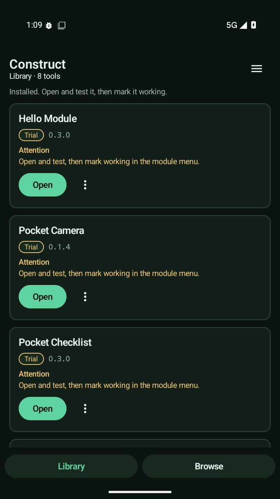
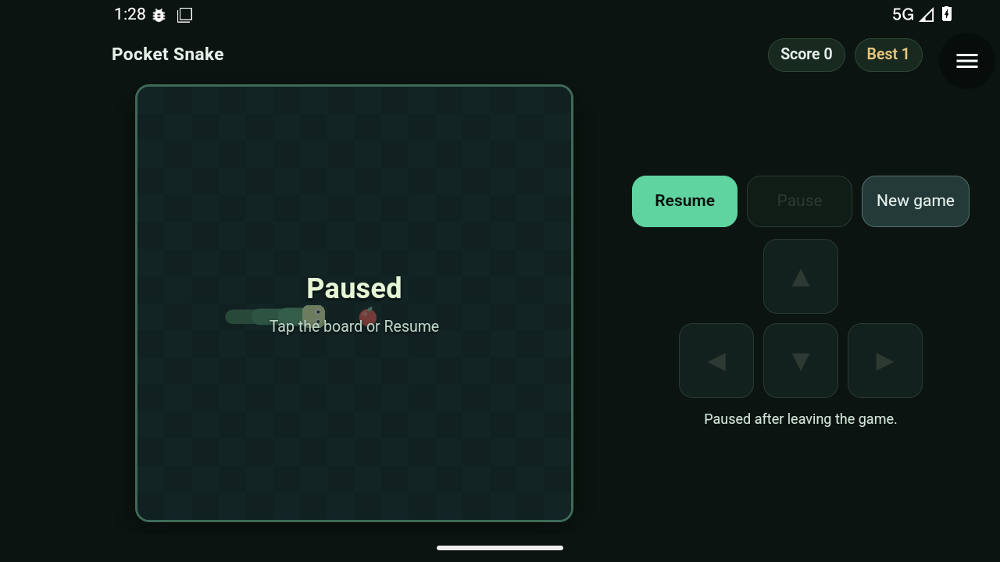
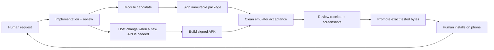

# Construct

### One Android host. Small downloadable tools. A testable development loop.

Construct is an experimental Kotlin/Compose Android app that installs signed
HTML/CSS/JavaScript modules and gives them a small, versioned set of native APIs.
The companion workflow takes a request from an agent-assisted workshop through
local tests, a disposable Android emulator, artifact verification and a private
module registry—then onto a real phone. Released modules can also be served from
the public static catalog, without a local server.

**Design principle: the host supplies defined capabilities; the modules contain
the applications.** Domain logic and feature UI should be independently updateable
in signed module packages. Some current native-workspace pilots do not yet meet
that boundary; they are migration debt, not the template for new tools. See the
[modular design contract](docs/modular-design.md) and [agent guidance](AGENTS.md).

*Actual Android emulator screenshot of the alpha21 UX pilot, using synthetic
test state. Installed tools live in Library; Browse presents one latest normal
release per tool, with version history available separately.*

*The native corner menu belongs to Construct; the game is a downloaded module.
See the [UX verification record](docs/ux-refresh/verification.md) for exact scopes
and the remaining physical-device check.*

**Experimental, MIT-licensed source release.** Build your own host and publisher
identity; this is not a production app store or a hardened hostile-code sandbox.
The public repository begins with a clean source import from the private pilot.
See [release provenance](docs/public-release.md) and [known limits](docs/evidence.md).

[How the workflow works](docs/workflow.md) ·
[Architecture](docs/architecture.md) ·
[Reproduction guide](docs/reproduce.md) ·
[Using Construct](docs/using-construct.md) ·
[Evidence and limits](docs/evidence.md) ·
[Module API](docs/module-api.md)

## Downloads and public catalog

[Android pilot APKs](https://github.com/blueworkslabs/construct/releases) are
published as GitHub Release assets, with version notes and checksums. The signed
module catalog lives in [`catalog/`](catalog/) and is deployed with Cloudflare
Pages at <https://construct-20x.pages.dev/>. Set the app's catalog URL to
`https://construct-20x.pages.dev/index.json`.
See [hosting, verification, and migration](docs/public-catalog.md).
Changing an existing app's catalog URL does not require reinstalling or resetting
its data. The pilot signing identity is preserved; self-built hosts with a different
publisher key need their own signed catalog.

## What it can do today

- Open installed tools from a local-only Library, browse a latest-first catalog,
  and keep setup and diagnostics behind the native menu. Shared, restrained
  green-black/jade styling covers the host and the eight example modules.
- Download, verify, install, update and roll back module code while retaining its
  separate local data. A failed update does not have to replace a working tool.
- Run Canvas games and ordinary web interfaces in a module-first native shell,
  with landscape support, native controls and per-module capability grants.
- Provide bounded local storage, short tones, read-only contacts and a native
  camera workspace. Contacts and camera require both a module grant and Android
  permission. Modules do not receive camera frames or arbitrary filesystem access.
- Keep installed tools usable offline within their capabilities. A registry is a
  delivery service, not a required backend for every module interaction.

Examples include **Pocket Checklist**, **Pocket Focus**, **Pocket Snake**,
**Pocket Contacts**, **Pocket Camera**, and **Pocket Measure**. Focus is a foreground timer, not a
background alarm. Camera photos start in a bounded app-private album; alpha 12
adds explicit native gallery copies on Android 10+. Alpha 13 adds user-requested
on-device face/common-object detection for selected photos, with bundled models.
No identity recognition, contacts editing or LAN discovery. See
[gallery export](docs/gallery-export.md) and [photo analysis](docs/photo-analysis.md)
for scope and current verification status. Alpha 15 adds
[Pocket Measure](docs/pocket-measure.md): choose one photo, confirm a printed
reference marker’s actual size, and tap two endpoints for an approximate planar
length. Processing stays native; no photo/result is exposed to module JavaScript.
Alpha 15's universal prototype was approximately 198 MB. Alpha 16's ARM64 pilot
is about **23.3 MB**, using architecture-specific APKs and a trimmed OpenCV
measurement bridge; see [size and verification details](docs/apk-optimization.md)
and [building](docs/building.md). Optional
[capability packs](docs/capability-packs.md) remain a design proposal.

## Two delivery lanes

**The design goal is module updates without a new APK once the required host API
exists. New native capabilities need host updates.** Current launcher-only tools,
including Sky Watch and Pocket Measure, still put their feature behavior in the
APK; their independent module delivery requires the documented migration.
The phone runs the module locally; Discord is the workshop, not the execution
environment or package transport. OpenClaw coordinates the work, but the underlying
build, publisher and runner are ordinary scripts rather than an agent-only format.

## What makes the workflow worth studying

The interesting part is the integration, not a claim to have invented Android
emulation, web modules, CI or agent-assisted programming:

1. Test the **exact optimized APK and signed module bytes** intended for delivery.
2. Restore an app-free emulator snapshot and verify that restoration actually worked.
3. Exercise real native and WebView controls, permission dialogs, provider data,
   interruptions, rollback and offline recovery.
4. Save structured verdicts and screenshots. A timeout, missing control or stale log
   is a failure—not a pass inferred from the absence of a crash.
5. Promote the accepted bytes, verify the served downloads, and reserve real-phone
   checks for things emulation cannot establish, such as touch feel and audibility.

Independent review and human feedback changed both the app and the test driver.
The [case study](docs/workflow.md) includes failures and scope boundaries, not just
successful screenshots.

## Start exploring

| Area | Source |
| --- | --- |
| Android host, native APIs and JVM tests | [`core/app`](core/app) |
| Runnable module sources | [`examples`](examples) |
| Manifest contract | [`schemas`](schemas), [API reference](docs/module-api.md) |
| Signed package builder/publisher | [`scripts`](scripts) |
| Headless Android acceptance driver | [`scripts/android-runner`](scripts/android-runner) |
| Minimal registry origin | [`server`](server) |

Start with the [reproduction guide](docs/reproduce.md). It distinguishes the local
build from operator-provisioned emulator/HTTPS infrastructure. Local defaults contain
no lab endpoint or private certificate; the complete setup is not a one-command installer.

## Status, trust and contribution

The reference alpha11 pilot passed 86 JVM tests and documented exact-APK emulator
scopes. That is **not** proof of comprehensive hostile-module isolation, production
readiness, or successful reproduction on somebody else's infrastructure. See the
[evidence ledger](docs/evidence.md) and [security model](SECURITY.md).

[Contributions](CONTRIBUTING.md) are welcome. See [LICENSE.md](LICENSE.md) for MIT terms and
[credits](docs/credits.md) for attribution. No novelty or “world first” claim is made.
