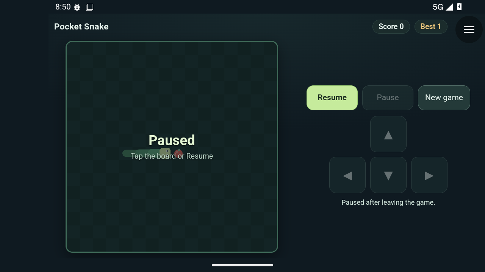
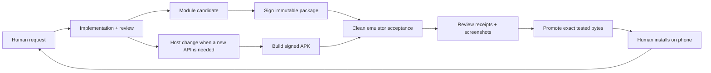

# Construct

### One Android host. Small downloadable tools. A testable development loop.

Construct is an experimental Kotlin/Compose Android app that installs signed
HTML/CSS/JavaScript modules and gives them a small, versioned set of native APIs.
The companion workflow takes a request from an agent-assisted workshop through
local tests, a disposable Android emulator, artifact verification and a private
module registry—then onto a real phone.

*Actual Android emulator screenshot of the alpha11 pilot. The native corner menu
belongs to Construct; the game is a downloaded module.*

**Experimental, MIT-licensed source release.** Build your own host and publisher
identity; this is not a production app store or a hardened hostile-code sandbox.
The public repository begins with a clean source import from the private pilot.
See [release provenance](docs/public-release.md) and [known limits](docs/evidence.md).

[How the workflow works](docs/workflow.md) ·
[Architecture](docs/architecture.md) ·
[Reproduction guide](docs/reproduce.md) ·
[Evidence and limits](docs/evidence.md) ·
[Module API](docs/module-api.md)

## What it can do today

- Download, verify, install, update and roll back module code while retaining its
  separate local data. A failed update does not have to replace a working tool.
- Run Canvas games and ordinary web interfaces in a module-first native shell,
  with landscape support, native controls and per-module capability grants.
- Provide bounded local storage, short tones, read-only contacts and a native
  camera workspace. Contacts and camera require both a module grant and Android
  permission. Modules do not receive camera frames or arbitrary filesystem access.
- Keep installed tools usable offline within their capabilities. A registry is a
  delivery service, not a required backend for every module interaction.

Examples include **Pocket Checklist**, **Pocket Focus**, **Pocket Snake**,
**Pocket Contacts**, and **Pocket Camera**. Focus is a foreground timer, not a
background alarm. Camera photos stay in a bounded app-private album, not the system
gallery. No contacts editing, camera export, face analysis or LAN discovery yet.

## Two delivery lanes

**A module update usually needs no new APK. A new native capability does.**
The phone runs the module locally; Discord is the workshop, not the execution
environment or package transport. OpenClaw coordinates the work, but the underlying
build, publisher and runner are ordinary scripts rather than an agent-only format.

## What makes the workflow worth studying

The interesting part is the integration, not a claim to have invented Android
emulation, web modules, CI or agent-assisted programming:

1. Test the **exact optimized APK and signed module bytes** intended for delivery.
2. Restore an app-free emulator snapshot and verify that restoration actually worked.
3. Exercise real native and WebView controls, permission dialogs, provider data,
   interruptions, rollback and offline recovery.
4. Save structured verdicts and screenshots. A timeout, missing control or stale log
   is a failure—not a pass inferred from the absence of a crash.
5. Promote the accepted bytes, verify the served downloads, and reserve real-phone
   checks for things emulation cannot establish, such as touch feel and audibility.

Independent review and human feedback changed both the app and the test driver.
The [case study](docs/workflow.md) includes failures and scope boundaries, not just
successful screenshots.

## Start exploring

| Area | Source |
| --- | --- |
| Android host, native APIs and JVM tests | [`core/app`](core/app) |
| Runnable module sources | [`examples`](examples) |
| Manifest contract | [`schemas`](schemas), [API reference](docs/module-api.md) |
| Signed package builder/publisher | [`scripts`](scripts) |
| Headless Android acceptance driver | [`scripts/android-runner`](scripts/android-runner) |
| Minimal registry origin | [`server`](server) |

Start with the [reproduction guide](docs/reproduce.md). It distinguishes the local
build from operator-provisioned emulator/HTTPS infrastructure. Local defaults contain
no lab endpoint or private certificate; the complete setup is not a one-command installer.

## Status, trust and contribution

The reference alpha11 pilot passed 86 JVM tests and documented exact-APK emulator
scopes. That is **not** proof of comprehensive hostile-module isolation, production
readiness, or successful reproduction on somebody else's infrastructure. See the
[evidence ledger](docs/evidence.md) and [security model](SECURITY.md).

[Contributions](CONTRIBUTING.md) are welcome. See [LICENSE.md](LICENSE.md) for MIT terms and
[credits](docs/credits.md) for attribution. No novelty or “world first” claim is made.
