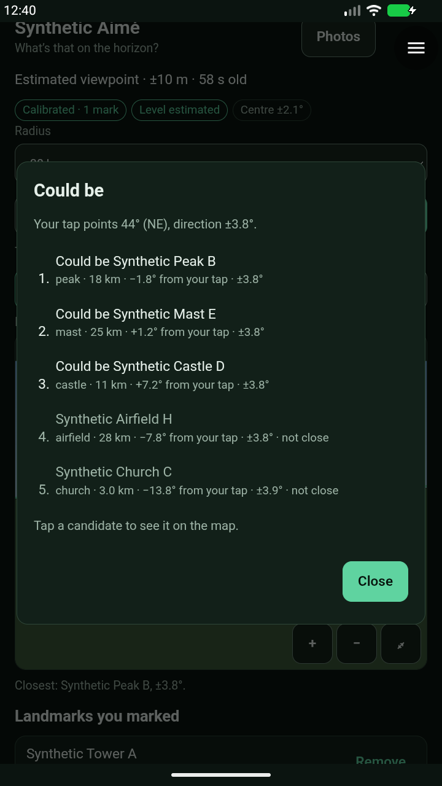
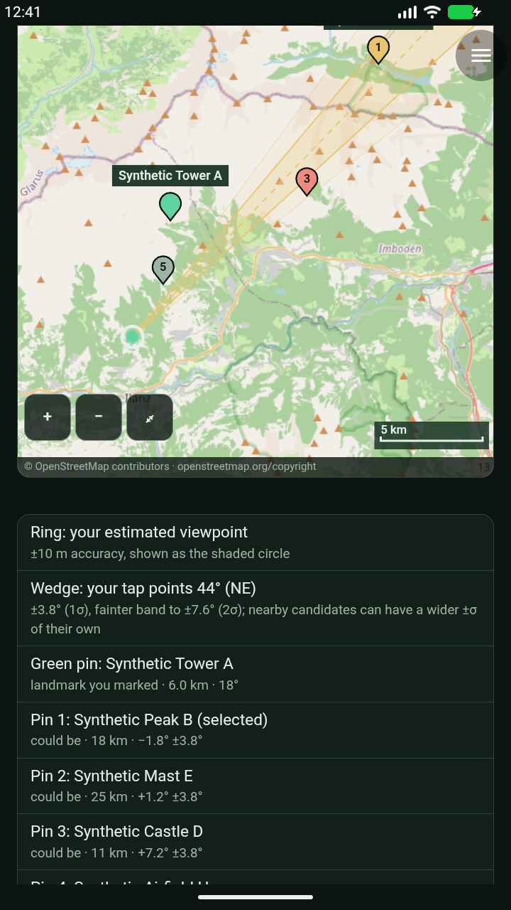
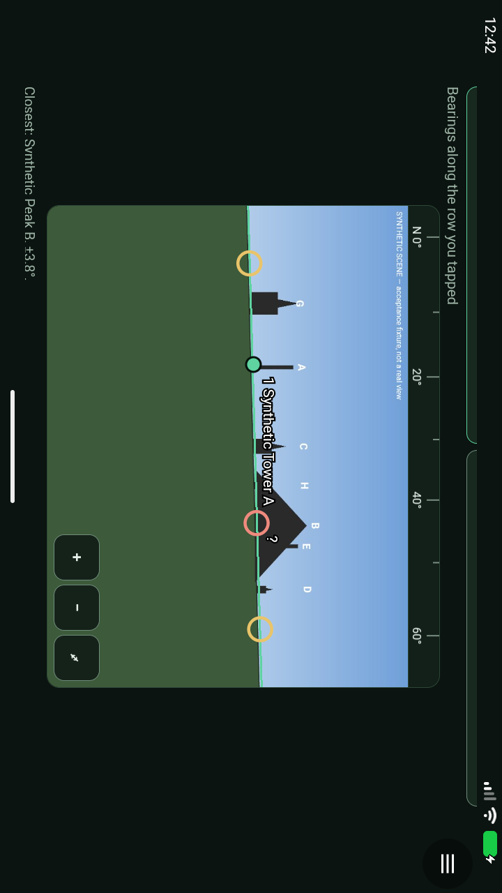
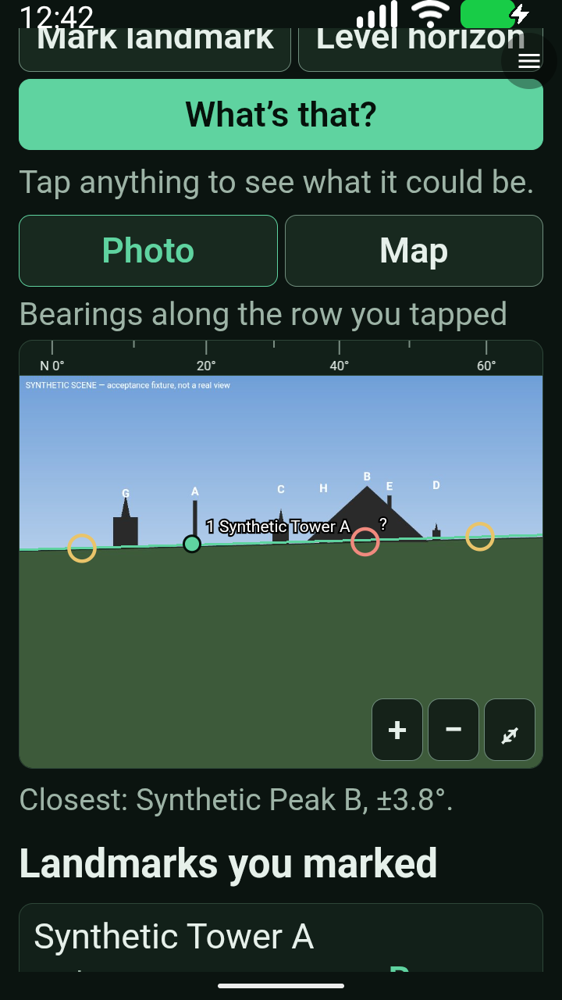
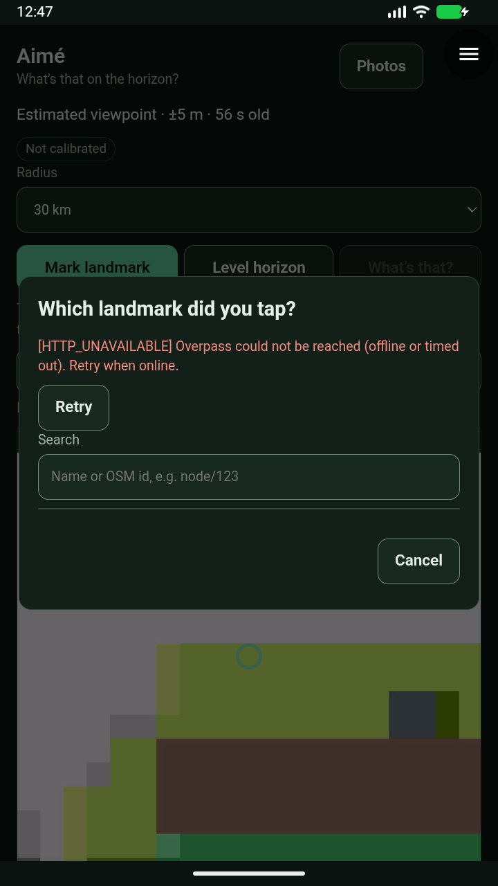

# Aimé 0.1.2 — staging blocked on live Overpass

**12/13 Android checks passed in the latest run; acceptance is incomplete. No hardware-test green light.** Both PRs remain draft and unmerged; production and the alpha32 release are unchanged.

[Machine-readable receipt](evidence/aime-0.1.2-staging-2026-09-27.json).

## Exact scope and result

- Combined PR34 + PR35, module source `0e0f345`; immutable real/fixture package version **0.1.2**.
- Unchanged accepted alpha32 x86-64 APK, source `2c132c9eeafd2b7757243c178efb190466bf2c94`.
- Android API37, WebView155.0.8059.0, disposable synthetic cameras.
- Run `20260927T003703Z-aime-a6476488`, driver `4b7ad4a`: **complete=false, stopped=true**. Emulator independently confirmed inactive afterwards.
- Both package downloads were hash/signature-verified from the commit-pinned GitHub catalog in the receipt. This was used because the Cloudflare preview remained pending; no verification bypass or production change.

Passed in this run: grants denied/granted, real native capture and saved viewpoint, injected offline/429 handling, landmark calibration, horizon levelling, expected candidate ranking and map, process restart persistence, full-frame landscape, 2× text without touch click-through, native-confirmed deletion with record reconciliation, and real-module denied location/internet behavior.

The final real-module lookup **failed twice**, with a 30-second pause before its single visible Retry. Both attempts returned `HTTP_UNAVAILABLE`. A separate request from the staging host using the same real 30 km query received **HTTP 504 after 10.29s**, with the server explaining `Dispatcher_Client::request_read_and_idx::timeout` and “The server is probably too busy to handle your request.” A tiny control query succeeded from staging in 6.76s; the same tiny query from the review host received the same busy-server 504. This establishes provider overload during the check, not a successful live lookup.

The host has an 8s read timeout and 15s total call limit; the Overpass query allows 20s server execution. No host timeout was widened, alternate origin added, radius reduced, or synthetic response substituted to make the acceptance pass. A cooldown recheck at 2026-09-27 01:34 UTC used the exact saved staging query with the same `Construct-Module/0.9` user agent and `Accept: application/json`; it timed out at the 15s host cap with `http_code=000` and no response body. The Android suite was not relaunched. Persistent failure needs a provider/query reliability decision, not more broad-suite retries.

## Review and fixes

Codex review and focused re-review are clear for the module fixes. Local checks pass: 19 module, 10 map, 19 solver, signed-package construction and browser regressions; the existing 71 runner tests also pass.

The fixed-pool per-photo store resolves PR34's 8192-character request-envelope blocker while respecting key and storage limits. Smaller fixes cover late-result navigation, moving-pinch anchoring, Overpass runtime errors, stale map results, hidden tile requests, cancelled/failed viewpoint edits and dateline framing.

Actual Android captures exposed two further defects:

- **0.1.1:** separates map zoom controls and scale bar, positioning them above the measured attribution strip.
- **0.1.2:** prevents a photo's pointer-up from opening a modal that consumes the same touch's compatibility click. A real Chromium touch reproduction fails against 0.1.1 and passes against 0.1.2; Android 2× text also passes.

Earlier attempts are retained individually in the receipt. They are not combined into a pass. Driver corrections cover offscreen controls, duplicate grant labels, settled bounds, active mode, and distinguishing completed counts from loading text. A clipped landscape-frame assertion in earlier attempts was insufficient; the latest run requires the full fixture aspect ratio and its screenshot was inspected. A follow-up bounded scroll-alignment correction was reviewed and checked with clipped-frame cases; it is **not part of the recorded 4b7ad4a run** and changes no module bytes.

## Reviewed captures

Unedited console captures of synthetic emulator data; FLAG_SECURE remains enabled. Landscape console pixels are rotated with the display. The map capture is scrolled to show controls and its text legend.

