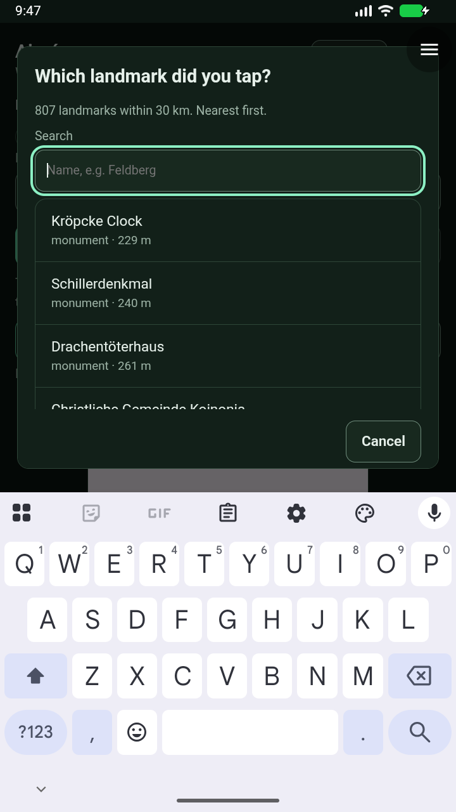
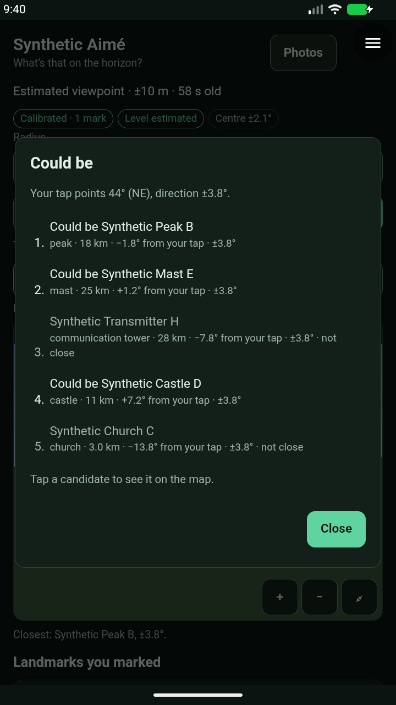
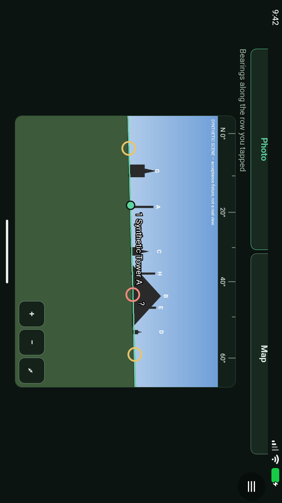
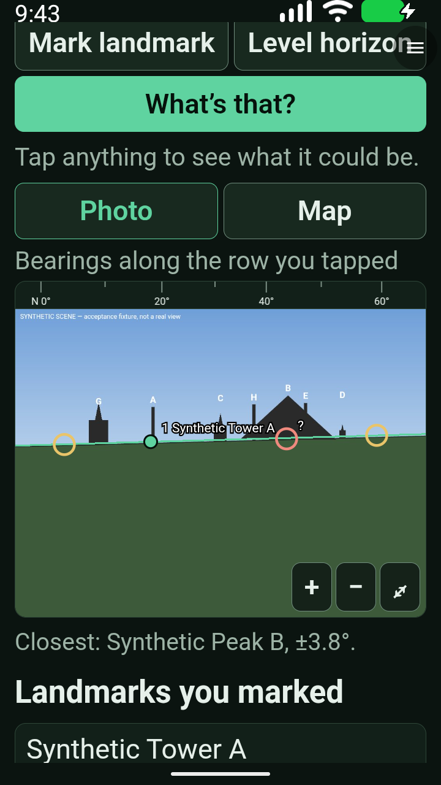

# Aimé 0.1.3 — first complete cell-data staging run

**14/14 Android checks passed**, including the first real Hannover lookup (807 landmarks, one attempt). The emulator stopped cleanly and its service was independently confirmed inactive.

[Exact-artifact receipt](evidence/aime-0.1.3-staging-2026-09-27.json) includes hashes, the complete check list, reviewed captures and the dataset audit. All 88 served cells match publication commit `dc92c619cd45d8e18bb48023cca90c7fa54da901`; dataset `2026-09-23.1-r1` contains 199,980 landmarks. The accepted alpha32 APK is unchanged.

This is **not the final hardware handoff**: subsequent review fixes for malformed indexes, partial coverage, legacy-mark reselection and privacy wording require immutable module version 0.1.4 and its own acceptance. No module PR is merged and no APK release is published.

The first 0.1.3 attempt stopped after three checks because a Gboard contacts/accounts permission dialog obscured the WebView. Its incomplete receipt is retained separately. The driver now declines only that exact unrelated system prompt; 75 runner checks and focused Codex review pass. The successful second run did not encounter that prompt, so the selector's handling is covered by the captured reproduction and unit checks, not claimed as exercised in that run. Emulator Bluetooth crashed during startup; no Construct crash was found in the crash buffer.

The real-data lookup ran through the host's existing granted network capability, with no timeout, origin-policy or response-size bypass. Synthetic fixture checks cover calibration, horizon levelling, ranking, map, restart, settled landscape, 2× text, outside coverage, deletion and failures. They do not establish physical-phone location or landmark accuracy.

