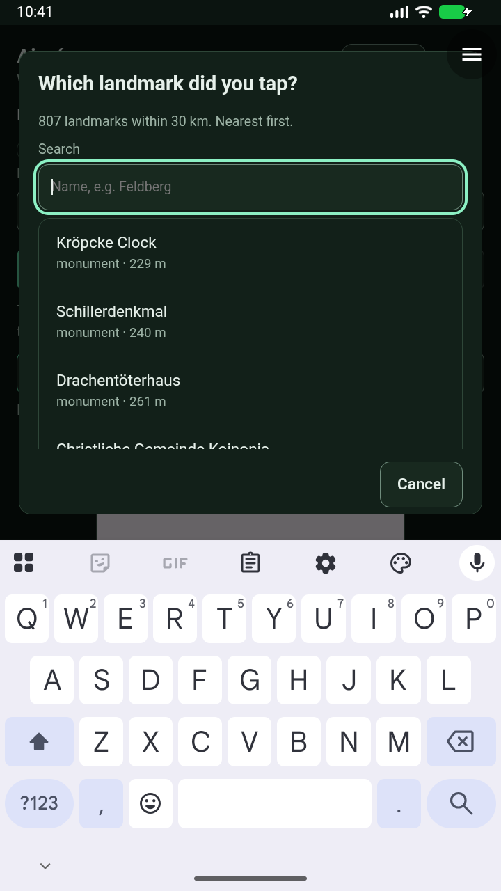
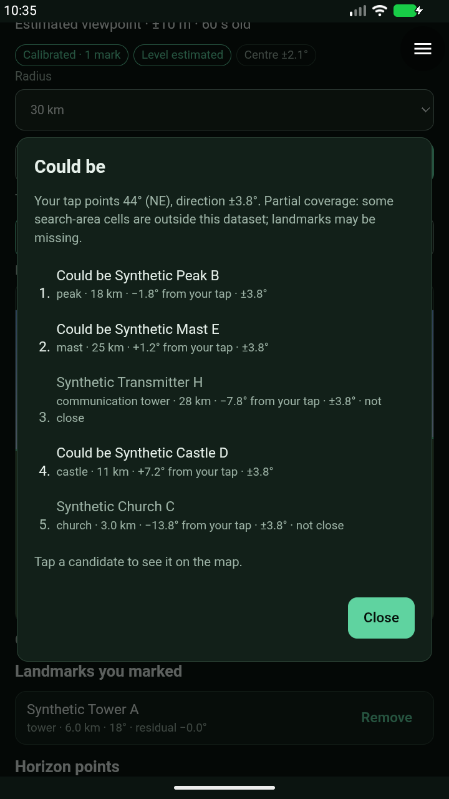
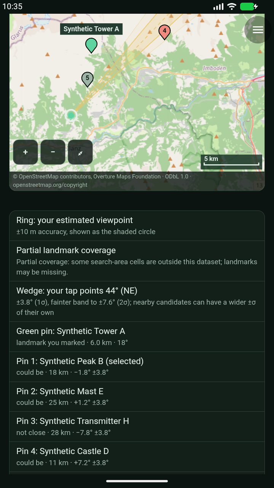
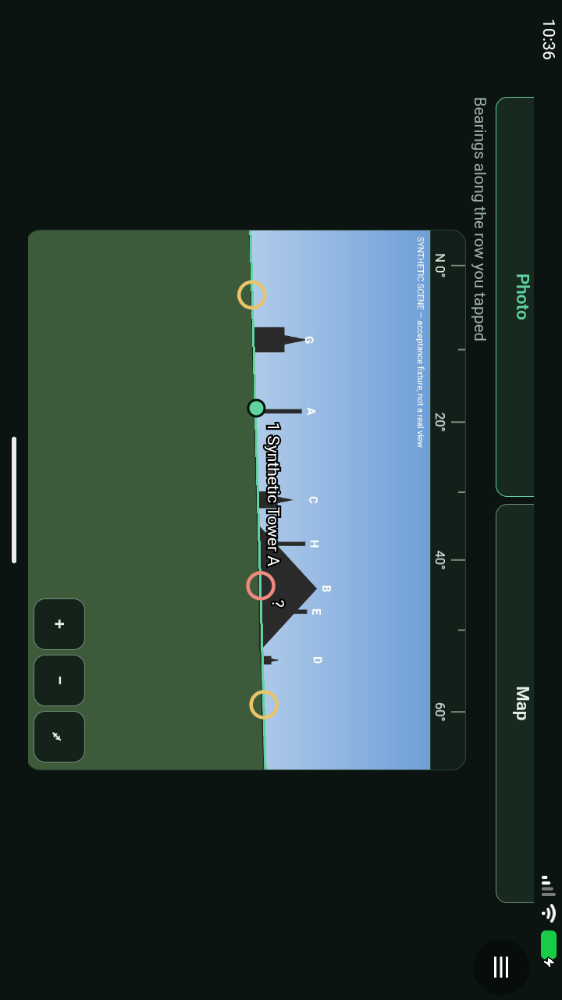
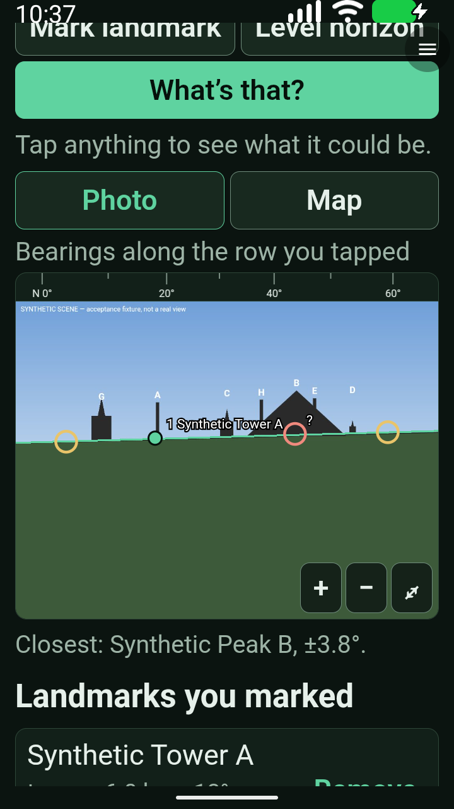
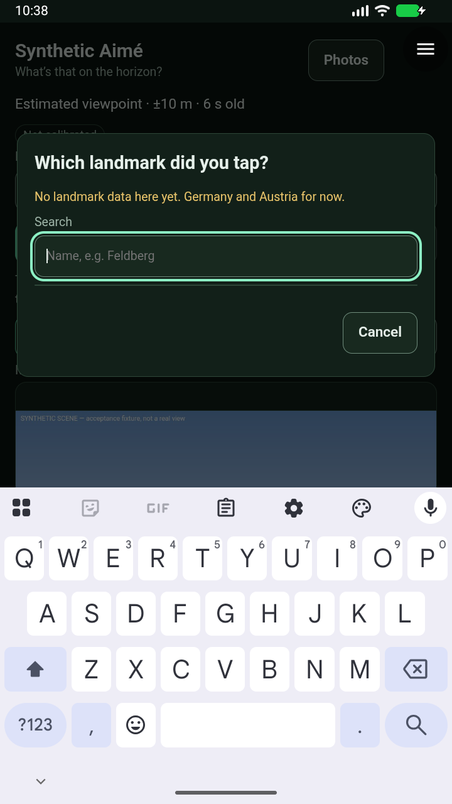

# Aimé 0.1.7 — Android acceptance and hardware handoff

**14/14 checks passed in one complete run**, `20260927T103132Z-aime-2767693a`. The emulator shut down cleanly; its service was independently checked afterwards. The exact signed 0.1.7 candidate is ready for a physical-phone pilot, not a production merge.

[Machine-readable receipt](evidence/aime-0.1.7-staging-2026-09-27.json) · [Hardware checklist](aime-0.1.7-hardware-check.md)

## Exact artifacts

- Module/fixture package commit `c807a0e1250f1e8e0b8dd68d61d9fd9e806917f1`; source `ee3e711`.
- Real Aimé SHA256 `c976f8bf307c33adeec287ee6aab77ed884fd3f9b7c608ec9592ec54430df19b`.
- Synthetic fixture SHA256 `217285ba707ea6809191f1c916de6bbec853fbf656c36e8ad73b927745222575`.
- Accepted, unchanged alpha32 x86-64 APK SHA256 `8c92858b02d6ea5a2a648eca8e9a7d94bb9870cbd6b11edcff708e3b479d3627`; Android API37 / WebView155.0.8059.0. No replacement APK required for the pilot's existing alpha32.
- [Pinned candidate catalog](https://raw.githubusercontent.com/blueworkslabs/construct/c807a0e1250f1e8e0b8dd68d61d9fd9e806917f1/catalog/candidates/aime/index.json). Install **Aimé**, not Synthetic Aimé; the latter is solely for disposable emulator acceptance.
- Dataset `2026-09-23.1-r1`, published commit `dc92c619cd45d8e18bb48023cca90c7fa54da901`. All 88 served cells match Git bytes; 199,980 landmarks, largest cell 316,045 bytes, 11,345,085 total cell bytes. Download audit used two concurrent requests and each completed within 15 seconds.

## Acceptance scope

Native capture and saved viewpoint; fresh denial and explicit grants; injected offline/HTTP503 recovery; landmark calibration and horizon levelling; candidate ranking and map; process restart; settled full-frame landscape; 2× text; outside-coverage messaging; native-confirmed deletion and record reconciliation; real-module location/internet gates; and a completed live Hannover lookup through the host's existing network capability.

The real lookup returned **807 landmarks within 30 km. Nearest first.**, in **1 attempt(s)**. No synthetic response was substituted in this real-module step, and no host limits or grants were bypassed.

The fixture crosses a missing cell boundary: its candidate sheet and map explicitly display partial coverage. The country polygons select full export cells; features are not clipped at national borders within those cells. The verified release includes Swiss landmarks in cell 47_8. Coverage warnings are conservative when an empty cell is not listed; neither full cell coverage nor a shortlist guarantees that every real landmark exists in Overture.

## Review and failed/superseded attempts

Review fixes include bounded per-photo storage, async navigation/touch handling, exact cell/index validation, per-feature uncertainty, partial-coverage notices, honest cell/tile privacy wording, and legacy mark reselection. Names are sanitized before display, identity matching and saving, preserving existing Overture direction-mark compatibility. Control-only names fail explicitly. Mixed malformed kinds fail the whole index explicitly. Malformed feature fields fail the whole cell rather than silently altering ranking metadata or producing a partial shortlist; the strict parser accepts all 199,980 published records, preserving their numeric positions, uncertainties and weights. 28 module, 10 map, 19 solver, package, architecture and browser checks pass; 75 runner checks pass. Focused Codex re-reviews are clear. The browser suite used the existing isolated Playwright environment (the review subprocess's default Python did not have Playwright).

The earlier [0.1.3 full pass](aime-0.1.3-staging.md) is separate evidence, not substituted for this package. Its first attempt stopped on Gboard's unrelated contacts prompt. A 0.1.4 attempt reached twelve checks before the SSH owner terminated, causing a broken pipe; another was deliberately superseded for the final metadata fix. Those receipts remain incomplete. The separate 0.1.5 run passed all fourteen checks, then was superseded by the final record-validation hardening. 0.1.6 also passed fourteen checks, then was superseded by the final label-sanitization correction. The final run was owned by a transient staging-VM user service with VM-local logs, independent of the observation connection.

## Limits and next gate

Physical-phone GPS/compass-free calibration accuracy remains unverified until the pilot's public-viewpoint test. Per-feature position estimates are heuristics, not survey guarantees. Known source-data gaps include Schloss Marienburg as a castle. **Do not roll back to Aimé 0.1.2 or earlier after saving cell-based marks**; old versions cannot read them and may discard them on save.

The new broad Android CI jobs are separate from the exact-package acceptance and were still pending when this handoff was prepared. PRs34/35/38 remain unmerged pending hardware feedback and final CI; alpha32 remains an unpublished draft.

Non-blocking hosting observation: index cache headers match the intended one-hour policy, while cell responses currently use Cloudflare's revalidation policy rather than the configured immutable cache rule. This does not alter their verified bytes or the host's no-store transport; cache optimization is not claimed as verified.

## Inspected final-run captures

Unedited console images of synthetic emulator data; FLAG_SECURE remains enabled. The landscape image is the settled full-frame before-tap capture, with original rotated console pixels. Map capture is scrolled to show the controls and explanatory legend.

