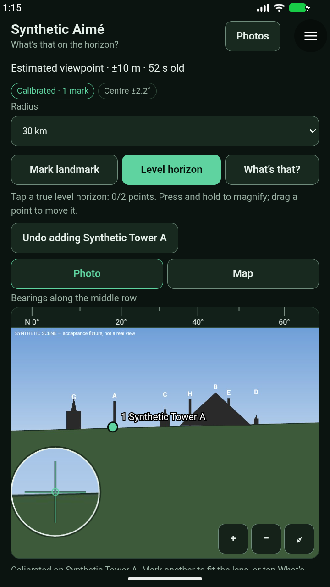
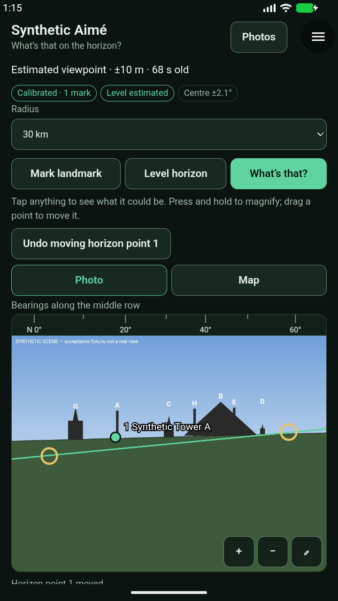
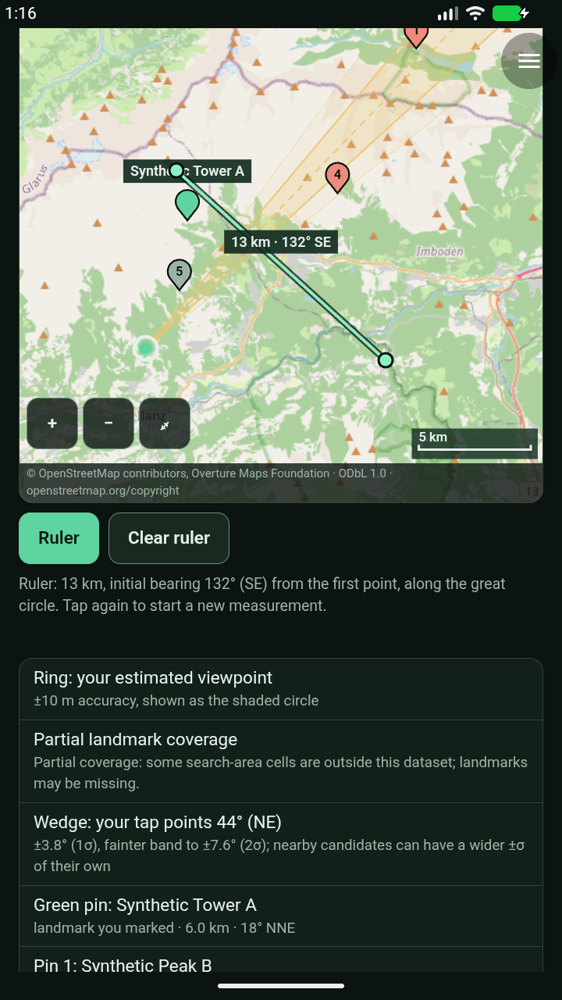
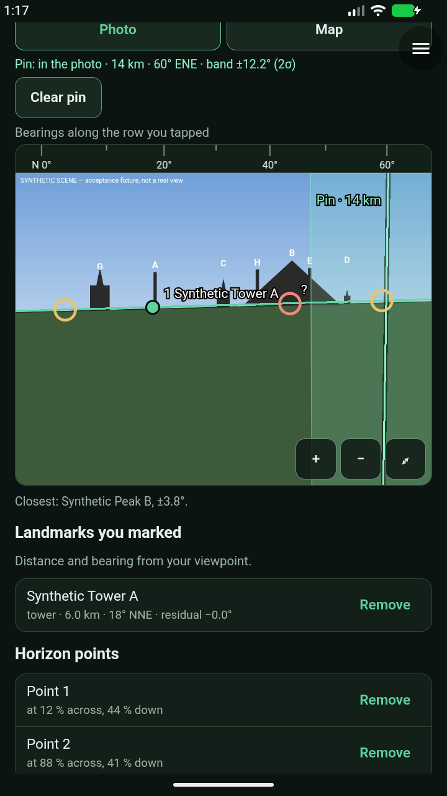
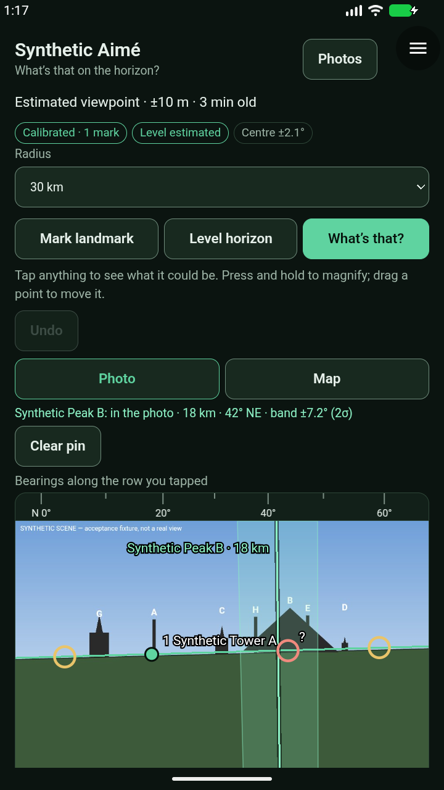
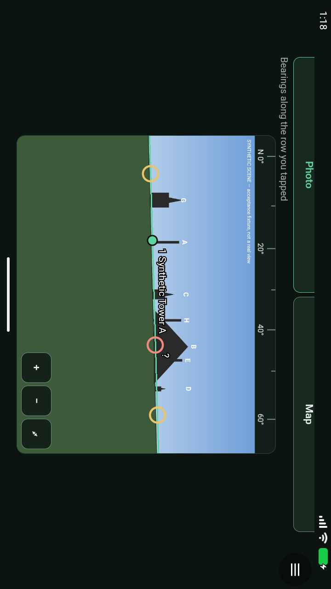
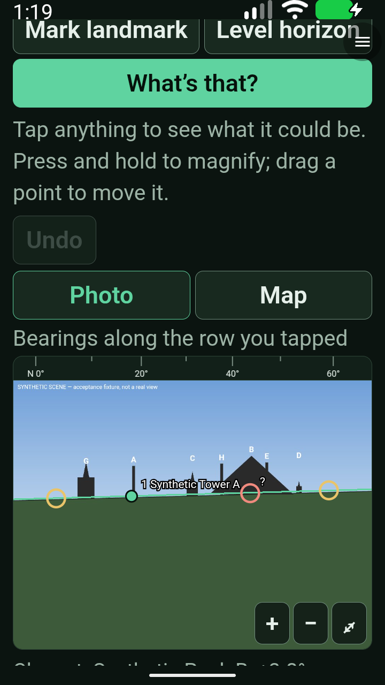
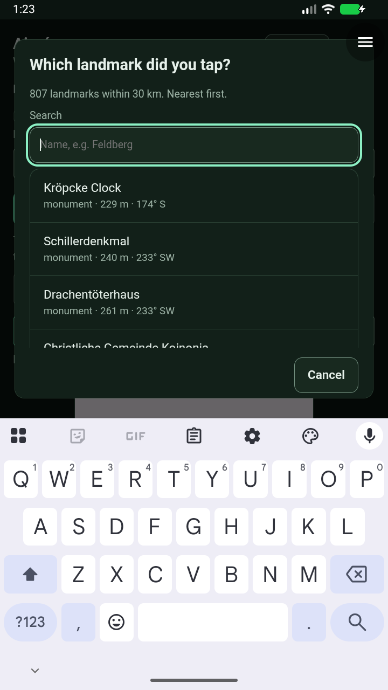

# Aimé 0.1.9 — precision-control Android acceptance

**18/18 checks passed in one complete run**, `20260927T131141Z-aime-6c7360e1`, on exact signed Aimé 0.1.9 and unchanged alpha32. The emulator shut down cleanly; both the emulator and runner services were independently inactive afterwards. Ready for a physical-phone controls pilot, not a merge or production promotion.

[Receipt](evidence/aime-0.1.9-staging-2026-09-27.json) · [Phone checklist](aime-0.1.9-hardware-check.md)

## Delivery and exact artifacts

This is a signed module-only update on the unchanged accepted alpha32 host. Native screenshot preferences, camera level/zoom and measured capture metadata belong to the separate API 0.13 host PR and are not included here.

- Source `4179040`; packages `5489c34095e0597a127bf78fe1782b8fd502975b`; runner `4179040`.
- Aimé SHA256 `f1f4cdf2e1ae425d2dfd338234db170b4d866db4b5d3133dc2532207b3e274cc`.
- Synthetic Aimé SHA256 `b6604c9f7ce6554ff5c418ed969da1df100efe4c93a71a5659ab3abca898727a`.
- Alpha32 APK SHA256 `8c92858b02d6ea5a2a648eca8e9a7d94bb9870cbd6b11edcff708e3b479d3627`.
- [Pinned candidate catalog](https://raw.githubusercontent.com/blueworkslabs/construct/5489c34095e0597a127bf78fe1782b8fd502975b/catalog/candidates/aime/index.json). Downloaded hashes and signatures match the existing publisher identity.

## Review

40 module, 14 map and 31 reference-solver checks pass; the two solver copies remain byte-identical. Browser interaction regressions, 75 Android-runner helper tests and the architecture check pass. Codex reviewed the integration and the focused fixes.

The review fixed a projected uncertainty band that incorrectly cut across frame corners on rolled photos. The solver now clips angular sectors against the actual frame; the regression checks pixel membership across 180 randomized poses. It also corrected the map legend using the previous dropped pin's details. Earlier lifecycle cancellation and ruler/viewer-ring fixes remain integrated.

## Attempts

The first launch was deliberately stopped before assertions to add the held-loupe Android screenshot. The second run passed 10 checks, then stopped when its map-pin press was too near the viewer ring (where pin dropping is intentionally suppressed); it shut down cleanly. The driver moves that press away and records the before-touch image and coordinates. These incomplete attempts are retained separately and never combined into a pass. No signed package bytes changed between attempts.

## Scope and limits

The 18-step suite covers grants, capture, explicit data-error recovery, calibration, held-loupe release, horizon points, dragging and undo, ranking/map, ruler, map pin/photo projection, process restart and candidate projection, landscape, 2× text, outside coverage, deletion/reconciliation, real permission gates and a live Hannover data lookup.

Physical-phone touch feel and accuracy for these new controls still require the pilot. A projected bearing line is not an object-height or exact-pixel prediction. Data position uncertainties remain source/geometry estimates. Do not roll back to 0.1.2 or earlier after saving cell-based marks. No host update, production-catalog promotion or module merge is implied by staging.

The third attempt passed 13 checks, then was deliberately superseded by the final dropped-pin ruler snapping fix. Its interrupted receipt remains incomplete; the owned emulator was stopped separately before the clean 0.1.9 run. The regression fails before the fix and passes after it; focused Codex review and the browser checks are clear.

## Served dataset

Dataset `2026-09-23.1-r2`, Pages commit `a9afc6ec1b46c2fefbe32f12b4e050dbceeb02eb`: all 88 HTTPS cells byte-identical to publication and validator-clean, 199,980 landmarks, largest 316,063 bytes, total 11,346,669 bytes; slowest audited cell 0.749 s with two concurrent requests. Retained r1 tree unchanged; Hannover/Innsbruck r1 HTTPS bytes also verified. Declination is additive and optional, and this module does not yet use magnetic heading.

## Final live check and reviewed captures

Real Aimé returned **807 landmarks within 30 km on the first attempt**, after explicit native location/internet grants. No fixture response was substituted. The crash buffer contained an emulator Bluetooth hardware-error abort, not a Construct crash. Broad source-and-Android CI remained pending at this handoff; PR #41 remains unmerged pending phone feedback and final CI.

## Tracked non-blocking wide-area precision edge case

[Issue #43](https://github.com/blueworkslabs/construct/issues/43): dropped-pin placement uncertainty currently uses map-centre latitude instead of pin latitude. The pin coordinate and bearing line are unchanged, but the band width can be inaccurate over large latitude differences. For a Hannover-centred map and targets within 60 km, this scale term differs by about ±1.3%; the local controls pilot is cleared, not general wide-area uncertainty accuracy. The next immutable module update should correct this and test far-apart latitudes.
