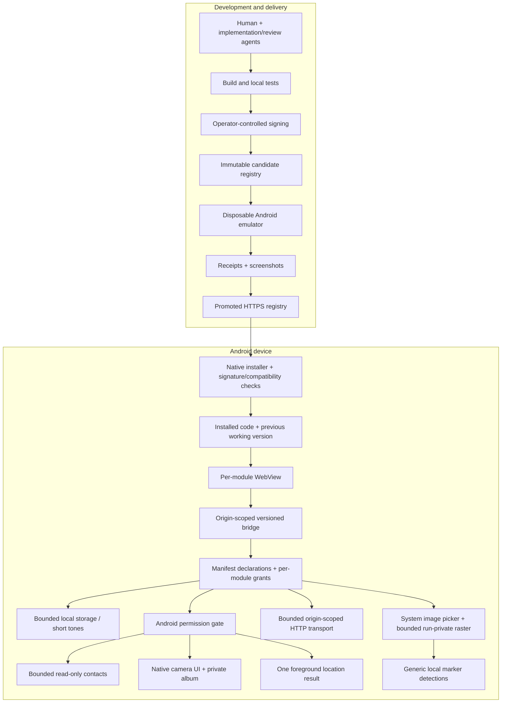

# Runtime architecture

The [modular design contract](modular-design.md) defines the intended ownership
boundary: Construct owns the runtime, authority and reusable capabilities; module
packages own applications. This page describes the **current implementation**,
including native-workspace exceptions that have not yet been migrated.

Construct has two distinct trust domains: the development/deployment machinery
and the Android host that actually runs installed modules.

## Host responsibilities

- `Packages.kt`: validate manifests, compatibility, ZIP structure, hashes and the
  pinned publisher signature before code becomes runnable.
- `ModuleStore.kt`: keep installed/trial/previous-working state, grants, module data
  and bounded diagnostics. Rollback changes code; data compatibility remains a
  responsibility of the module author.
- `ModuleActivity.kt` / `ModuleSessionView.kt`: native module-first shell, menu,
  retained WebView rotation, paused in-session diagnostics and real-background
  teardown. Access changes stop the module before the native access screen.
- `ModuleWebView.kt`: local module resources, restrictive WebView configuration,
  origin-scoped bridge and native request/lifecycle enforcement.
- Native contacts/camera components: fixed operations and bounds instead of
  caller-selected provider URIs, raw SQL, arbitrary paths or camera frame streams.

### Module-owned Sky Watch (API 0.9)

Sky Watch 0.2.x contains provider adapters, coherent-report merging, identity tables,
metadata interpretation, refresh/backoff policy, Canvas map/tiles and HTML controls
in `examples/sky-watch-module`. It does not call `sky.watch` or receive aviation
objects from the host. `ModuleHttp`/`HttpPolicy` supply bounded approved-origin GETs;
`ModuleLocation` supplies one explicitly granted foreground fix. Native consent,
Android permission UI and session authorization remain outside module control.

### Module-owned image workflows (API 0.10–0.11)

The alpha31 candidate has no remaining native application-workspace exceptions.
Pocket Measure 0.2.x owns calibration, geometry, endpoints, units and rendering;
API 0.10 supplies bounded image selection/decoding and generic marker corners.
`ModuleImageSession` owns run-private image authority and bounded processing,
not measurement policy.

Pocket Camera 0.2.x owns the album, photo selection, analysis workflow, result
presentation, overlays and score filtering. API 0.11 implements reusable
`camera.photo`, `photos.library` and `image.analyze` capabilities with fresh grants.
The native capture surface provides only visible acquisition controls, not album
or analysis screens; native inference returns bounded results for a selected
still image. No continuous camera-frame stream crosses the bridge.

The broad Camera workspace was host-owned through alpha30. Alpha31 retires
`camera.capture`, preserves private originals and requires an explicit module
update and fresh authority. See the [photo contracts](module-photos.md),
[retirement handling](shell-retirement.md) and
[exact-artifact acceptance and limits](camera-alpha31-acceptance.md). The tested
alpha31 pilot is published; user-reported Pixel testing passed. The acceptance
report separates that feedback from measured emulator evidence.

## Module contract

A module ZIP contains `manifest.json` and its declared entry point plus HTML/CSS/JS
and assets. Module tests stay in the repository; they are not shipped into the ZIP.
The manifest identifies the module/version, runtime, API target and requested
capabilities. API0.6 adds a validated theme colour and host-owned corner-layout CSS.
See the [module API](module-api.md) and [manifest schema](../schemas/module-manifest.schema.json).

The native menu is not HTML controlled by the module. A cooperative visibility
event lets games pause/save; native capability gating does not rely on that
cooperation. Storage can finish a submitted save while menu-paused. Non-storage
host calls are gated, effects stop, and stale personal-data replies are invalidated.
This is not a claim that every possible JavaScript timer or WebView audio path stops.

## Lifecycle boundaries

Web modules retain their live session through orientation changes. Snake explicitly
pauses rather than catching up after rotation. Leaving the app ends the session;
reopening uses each module's saved state. Process death is not silently treated as
an in-memory resume. The bounded native capture surface has a separate policy: rotation
or backgrounding closes/releases it and ends its parent image run; previously
saved photos remain. An explicit shutter/cancel returns to the same module run.

## Deployment boundaries

There are two independent signing identities: the Android APK identity and the
module-publisher identity pinned by the APK. A valid signature establishes publisher
provenance, not harmlessness. HTTPS validates registry transport; it does not replace
package signatures. Generated keys and private test/deployment material do not
belong in the public source distribution.

## Native Sky retirement

The alpha28 candidate removes native Sky implementation code. Old `sky.watch`
packages remain readable for management but require a module update; they cannot
execute or be restored through rollback. See the [compatibility boundary](shell-retirement.md).
Alpha29 also retires `photo.measure`; see [the image/migration contract](module-images.md).
The alpha31 candidate also retires `camera.capture`: no native application
workspaces remain in its source. Generic visible acquisition and bounded local
inference remain host capabilities; the module owns the album and analysis UI.
See [photo contracts](module-photos.md) and [measured prototype limits](camera-prototype-results.md).
This source boundary does not substitute for exact-artifact migration acceptance.
