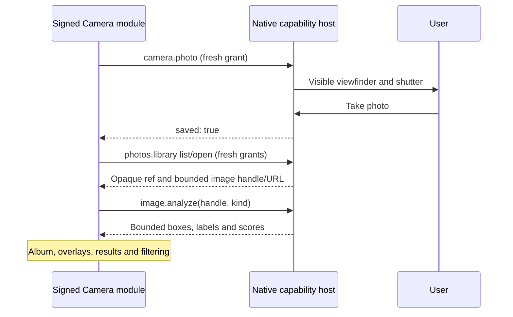
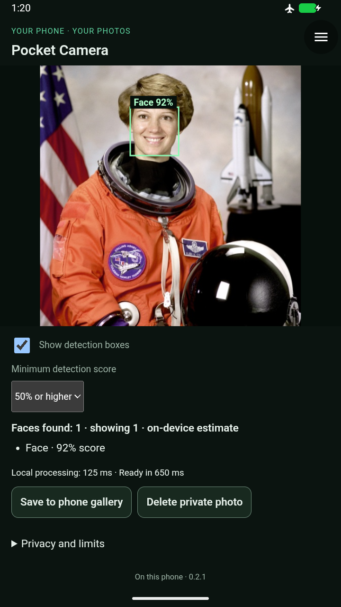

# Camera extraction — alpha31 candidate verification

The [alpha31 pilot](https://github.com/blueworkslabs/construct/releases/tag/v0.1.0-alpha31)
was published on 2026-09-20 with the unchanged APK/module bytes documented below.
PR #30 adds only the verified Camera 0.2.1 catalog entry; existing versions and
other modules remain unchanged. Exact optimized-APK scopes are recorded below.

## Physical-phone feedback — 2026-09-20

The pilot tester confirmed on a Pixel that it "works as expected" and approved
merging PR #30. This is a positive user-reported functional result, separate from
the synthetic emulator receipts. The Pixel model, Android version, individual
checklist results, timing, accuracy, thermal and battery measurements were not
provided; no quantitative phone-performance claim is inferred.

## Ownership and compatibility

The signed Camera module owns its private-album workflow, selected photo,
analysis actions, result interpretation/presentation, overlay rendering and score
filter. The host provides reusable CameraX acquisition, native grants and
confirmation, bounded private-photo/image resources and local inference. The
host no longer contains native Sky, Measure or Camera application workspaces.
The native capture surface cannot browse an album or present analysis results.

Alpha30 is the last native Camera host. In this candidate, installed modules
requiring retired `camera.capture` retain saved data but show Update required.
Their old grant cannot authorize pixels, private library access, new capture or
local inference. Supported module updates/rollback retain private originals.
Rollback/reinstallation of retired native modules is rejected before execution.
Host-managed deletion of saved photos remains available even for an old module.

## Exact artifacts

Native source `b11381e8ea38d73bd678c2715b67c62ef4bb790c`; later changes are runner, documentation and catalog only; host/module source is unchanged.
Camera 0.2.1 is immutable; packaged entries match source and publisher version
substitution. Earlier `e153819` and `7fad73a` APKs failed native-preview visual
review and are not accepted replacements. The final acquisition layout explicitly
bounds/clips its viewfinder and separates scrollable controls in landscape.

- arm64-v8a APK SHA-256 `edf404f164520aa15ba5d8ae8788b6539d3b595384ba5684a22101744fdfc952`, 23,806,330 bytes.
- x86_64 APK SHA-256 `237a169c5eccd72d2353ddd8f3090ece106b2332f493e98e0d972b51763d5264`, 26,689,915 bytes.
- Camera 0.2.1 ZIP SHA-256 `6bf8b7d63557b920a1d3b3f63bd061a50d9e141c65009d84720ca4fb15548b22`.

Both APKs preserve alpha30's signing identity and permission set. All 22 protected
assets/native libraries remain byte-identical; generated DEX optimization profiles
change with the application build and are excluded from that comparison. Models,
16 KB native load segments and architecture-specific size budgets pass. Debugger
access is not enabled in these APKs. Legacy Activities are absent from manifest
and packaged code.

## Verification

- 187 JVM tests passed, no failures/errors/skips; lint has zero errors.
- 12 Camera and 29 Measure module tests passed.
- Architecture checks pass with no native application-workspace exceptions.
- Optimized migration: **6/6 passed**, complete and stopped, including preserved
  real-shutter original, fresh grants and blocked retired rollback/reinstallation.
- Optimized Camera functional/privacy/layout scope: **18/18 passed**, complete and stopped.
  All four grants were revoked independently and source-photo hashes stayed identical.
- Optimized signed Camera 0.2.0 → 0.2.1 → 0.2.0 update/rollback: **7/7 passed**,
  including actual camera switching and both delivery checks. All three installed
  APK hashes match; rollback restores working inference and older controls.
- Existing Measure 0.2.5 regression on the changed host image pipeline: **19/19
  passed**, complete and stopped, including reviewed loupe and 2×-text captures.
- Focused optimized native capture-label visibility scope: **4/4 passed**, complete
  and stopped. Fully revealed 2×-text Cancel labels were visually reviewed in both
  orientations. This supplements the full functional scope, not four new features.

During the optimized run, automated face requests took 476–650 ms end to end
and object requests took 711–837 ms. These include active UI-automation overhead,
are not controlled frame-time measurements, and are not phone latency guarantees.

Debug prototype results and incomplete attempts remain separate in
[camera-prototype-results.md](camera-prototype-results.md). Its 13/13 functional
receipt and successful signed update/rollback do not substitute for the scopes
above.

## What this does and does not establish

This preserves the existing **saved-photo** analysis workflow. Native CameraX
still displays live preview; native CPU inference returns bounded results for a
selected still image. No continuous live-frame stream was built or benchmarked.
The debug experiment measured improved inference UI responsiveness after
module-only canvas/animation changes, but repeated full-canvas drawing remained
slow on this software renderer. Those controlled timings are not pilot/phone
performance guarantees.

Face screenshots use the public-domain NASA astronaut fixture; cat screenshots
use the CC0 Chelsea fixture by Stefan van der Walt, with pinned provenance in
[vision-assets.json](../scripts/vision-assets.json). All delivered PNGs are
unmodified emulator-console captures; landscape files retain device orientation.

Device evidence uses synthetic camera input and licensed fixtures on a disposable
API37 emulator. It cannot establish physical ARM64 camera behavior, detector
accuracy on personal photos, thermal endurance or battery drain. Phone acceptance
remains outstanding. Original images are not rewritten by analysis; clearing a
module view or revoking access does not delete private originals or gallery copies.

## Review artifacts and installation pairing

The PR adds only the immutable signed Camera 0.2.1 package to the catalog and
makes it the Camera latest entry; no existing ZIP is overwritten. Until merge,
the default catalog still advertises legacy Camera 0.1.4. The exact module used
for these scopes is available from the isolated
[test catalog](https://7811cff5.construct-20x.pages.dev/index.json).
Install the alpha31 host in place (do not uninstall), then update Camera and
explicitly grant the new authorities. The capture grant does not replace Android
camera permission; capture can be allowed separately from access to old photos.

That Camera test catalog contains Measure 0.2.2, not the 0.2.5 loupe release.
Measure regression uses its separately pinned 0.2.5 catalog. Do not describe a
catalog switch as a Measure upgrade or combine unrelated catalog promotions.
No alpha31 public APK release or production deployment is implied by this report.

## Physical-phone pilot check

Use the exact alpha31 ARM64 APK and signed Camera 0.2.1 above; installing only
the new module on alpha30 does not provide API 0.11. Install the APK in place,
then update Camera using the review/test catalog and review the fresh grants.
Do not uninstall if checking retention of existing private photos.

1. Check old private photos remain available after granting library/pixel access.
   Take a disposable photo with each camera, switch cameras, and cancel a capture.
2. Run face/object detection on a few ordinary photos, including a blank scene.
   Compare the first run with repeat runs; note total wait, touch responsiveness
   and any noticeable warmth. A missed detection is not proof of a runtime failure;
   report an error or timeout separately from an inaccurate model estimate.
3. Check portrait, landscape and large text on the analysis screen. On the native
   viewfinder, rotation/backgrounding intentionally cancels capture and closes
   the transient run; it must release the camera and keep saved originals.
4. Using a disposable photo, cancel and then confirm gallery export/deletion.
   A phone-picked image must not enable deletion/export of an unrelated private photo.
5. Background/reopen the module: selection/results should clear, the private album
   should remain. Revoke a grant in Module access and confirm the relevant action
   is denied until explicitly re-enabled.

Report phone model, Android version, approximate first/repeat analysis waits and
any reproduction steps for a stall or layout issue. Sharing personal photos is
not necessary. Record these as phone observations, separate from emulator receipts.

## Reviewed visual evidence

[Sanitized receipts, exact hashes and all selected capture hashes](evidence/camera-module-alpha31-2026-09-18.json).
The controls pane is intentionally scrollable; a partially offscreen heading or
supporting item after scrolling is not presented as simultaneously visible content.
The final focused probe rejects clipped Cancel label bounds before capturing it.
Ordinary Android screenshots remain protected; these are the disposable emulator's
console-display captures, not a weakening of the app's secure-window flag.

- Native capture: [portrait](images/camera-alpha31/capture-portrait.png),
  [landscape](images/camera-alpha31/capture-landscape.png),
  [2× portrait with Cancel](images/camera-alpha31/capture-large-portrait-cancel.png),
  [2× landscape with Cancel](images/camera-alpha31/capture-large-landscape-cancel.png).
- Analysis: [2× portrait](images/camera-alpha31/analysis-portrait-large.png),
  [2× landscape](images/camera-alpha31/analysis-landscape-large.png),
  [system-picked image and disabled private actions](images/camera-alpha31/phone-photo-analysis.png).
- Migration: [large-text recovery](images/camera-alpha31/retired-camera-large.png),
  [retired access and host deletion](images/camera-alpha31/retired-camera-access.png),
  [fresh consent](images/camera-alpha31/fresh-camera-consent.png),
  [retained photo](images/camera-alpha31/preserved-camera-photo.png).
- Module-only behavior: [90% filter](images/camera-alpha31/module-score-filter-90.png)
  and [50% filter](images/camera-alpha31/module-score-filter-50.png), without reinference.
- Shared-host regression: [unchanged Measure loupe](images/camera-alpha31/measure-loupe-regression.png).
