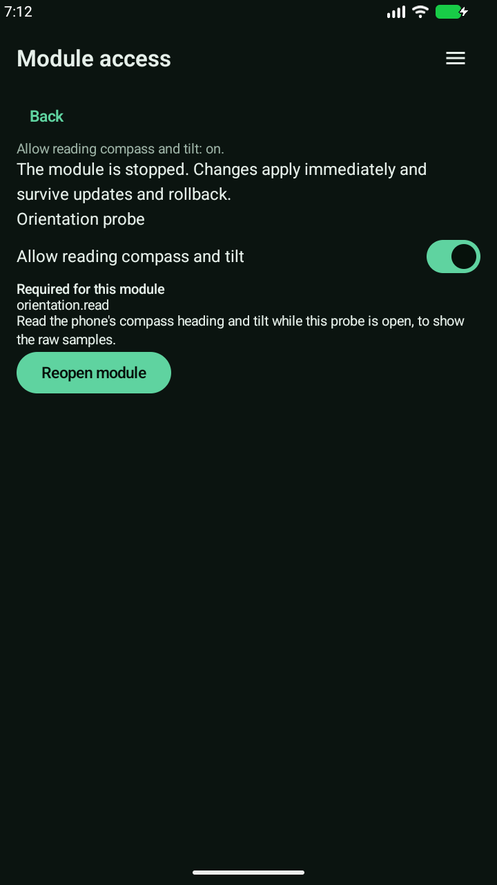
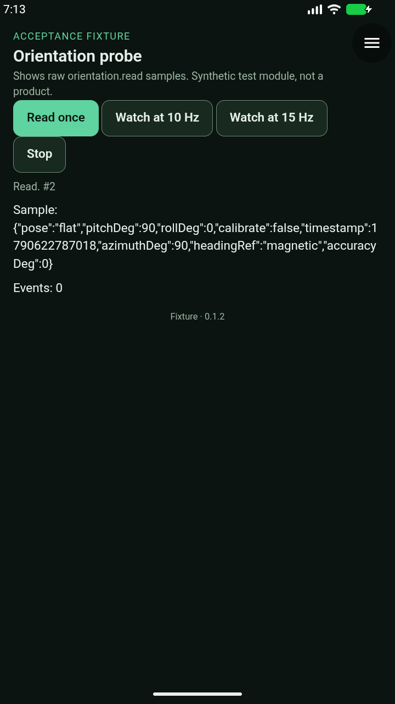
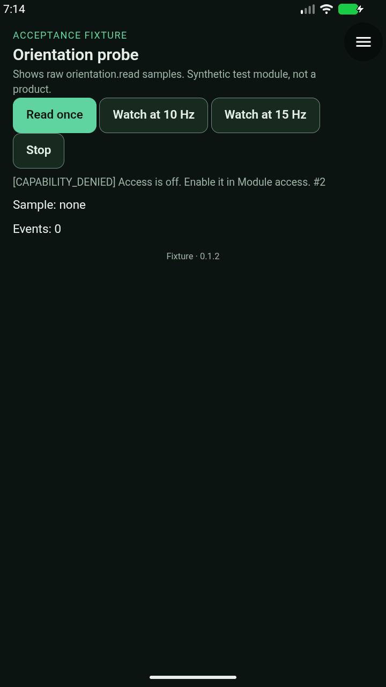
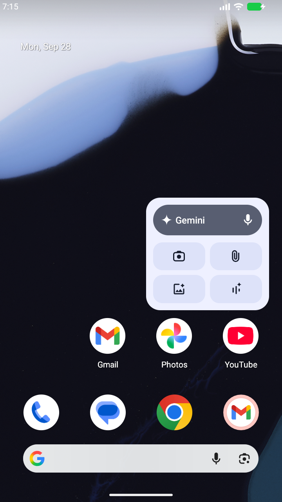

# API 0.14 orientation — alpha35 staging

**Held: foreground lifecycle fix required.** Android acceptance stopped at **6/9**
checks because the module retained a native rotation-vector connection after Home.
This is not hardware clearance. Neither [#51](https://github.com/blueworkslabs/construct/pull/51)
nor its API 0.13 base [#42](https://github.com/blueworkslabs/construct/pull/42) was merged by this review.
Space Watch follow mode remains separate draft #52; production modules are unchanged.

## Review changes and local checks

Host source: `1f33a838f8637738c0d28a0cf28b9e5845652296`.

- Bumped the host to alpha35 / versionCode 35, distinct from alpha34.
- Failed sensor registration no longer leaves subsequent reads permanently busy.
- Watch replacement and stop/restart no longer reset the stream delivery budget.
- Corrected the API's cancellation contract: the existing generation-checking bridge
  returns `RUN_PAUSED` when the menu interrupts a pending read. Native cancellation
  still occurs immediately; no paused result is delivered.

The two new regressions fail against the original implementation and pass after the
fix. **254 JVM tests, lint, 35 package tests, 91 runner-helper tests and the architecture
check pass.** Lint retains existing warnings, not errors. Independent GitHub Codex
review findings about versioning, registration recovery and cancellation documentation
are addressed; its [activity-pause finding remains open](https://github.com/blueworkslabs/construct/pull/51#discussion_r4125971087).

## Exact artifacts

Both optimized APKs passed signature verification against the existing APK signer,
16 KB alignment, ABI/native-library checks, publisher-key identity and unchanged
bundled model checks. ARM64 execution on a physical phone was **not tested**.

- ARM64 SHA-256: `d11f3262620ac608b9ad15b050697cb84861ef0fa9eb0bb289365065fd3ca42e`
- x86-64 SHA-256: `7b0be4a729c743a699c8dff749ac7f5f72cc515901d0a6c373e29661421bc5ba`
- Signed Orientation probe **0.1.2**: `cc1633a35c8ec6ac1f6f2372d060325b060d7e1d4dc4e512ad1ae6f8f8b3df23`
- [Isolated probe catalog](https://raw.githubusercontent.com/blueworkslabs/construct/b621e7394487962224f92a853424a424b8a54962/catalog/candidates/orientation-probe/index.json)
  (served ZIP hash and publisher signature verified; not a production catalog).

The APK downloads remain an unpublished draft explicitly marked **HELD**. Do not
promote this candidate or use it as the accepted host for follow mode.

## Android evidence

Run `20260928T191114Z-orientation-f846a001`, disposable API 37 emulator, clean
snapshot, unprivileged ADB. Executed runner source:
`b621e7394487962224f92a853424a424b8a54962`.

[Sanitized receipt and original-image hashes](evidence/orientation-alpha35-staging-2026-09-28.json).

Passed:

1. Signed installation and digest verification; get/watch denied before native opt-in.
2. Flat north/east readings match injected magnetic inputs; bounded field set and precision.
3. Upright east and +10° downward pitch match the expected axes/signs.
4. 10/15 Hz streams stay within their rate bounds; explicit stop leaves event counts stable.
5. Native menu pause releases the sensor; returning does not restart the stream.
6. Revoking required access, including its native confirmation, releases the sensor;
   get/watch are denied after reopening.

The runner injects acceleration, magnetic field and zero gyro readings. The emulator
has no direct rotation-vector injection control: these observations use Android's
fused rotation-vector sensor. Its synthetic accuracy value was 0°, which is **not** a
claim about physical compass accuracy.

### Failed background gate

After starting a watch, pressing Home and waiting one second (plus command latency),
`dumpsys sensorservice` still showed **one active rotation-vector connection** for the
app UID, with sensor access enabled and buffered events. The failure capture shows
Launcher. The native counts were:

- watching: **1**
- explicit stop: **0**
- menu pause: **0**
- revoked grant: **0**
- after Home: **1** — expected 0

This establishes retained native sampling after leaving the module. It does **not**
prove that queued samples executed in JavaScript after Home, nor establish the exact
`onPause`/`onStop` state at that instant: this run did not retain an activity dump there.
The source finding independently identifies the missing pause-only enforcement:
`ModuleActivity.onPause()` changes the privacy curtain without canceling orientation
or closing its request gate; cleanup otherwise waits for menu/picker cancellation or
`onStop()`.

The run stopped at that assertion. Process-restart completion, landscape/200% text
and the separate translucent-resolver pause-only gate were **not reached**. They must
not be inferred to pass from earlier Space Watch runs. A post-run driver improvement
now retains the failure count and activity state before asserting; that added diagnostic
retention was not part of this receipt.

The emulator stopped cleanly; the runner exited 1 for the asserted failure, and the
emulator service was independently confirmed inactive. Retained logs contain the
recurring emulator Bluetooth startup SIGABRT, with no Construct fatal exception found;
this is not a globally empty crash-buffer claim.

### Original Android captures

The receipt links the other original captures. The displayed readings and controls
were visually inspected in portrait. Landscape and enlarged-text captures are absent,
not silently waived.

## Earlier attempts and fixture corrections

- Probe 0.1.0: 5/8 checks passed; the driver did not handle the native required-access
  revocation confirmation. Clean shutdown. Its JSON overflowed horizontally.
- Probe 0.1.1: 0/8 checks passed. The inline-style wrapping change was blocked by the
  host content policy and the module stopped with `JAVASCRIPT_ERROR`. Clean shutdown.
- Probe 0.1.2 moves wrapping into a packaged external stylesheet and handles the native
  confirmation. The final captures verify the full reading is visible. The host APK
  stayed byte-identical across these attempts; previous immutable probe versions remain
  historical test artifacts, not recommended installations.

## Required follow-up

The activity-lifecycle change is handed back to the author before a new APK candidate:

- Cancel pending reads and unregister orientation when the activity pauses, even if it
  remains visible and `onStop()` has not run.
- Reject new reads/watches and stale data delivery while paused; do not rely only on
  canceling the existing listener.
- Preserve deliberate image/camera picker completion handling.
- Resume must not resurrect a watch without a new explicit request; communicate the
  lifecycle transition consistently to modules.
- Add lifecycle regressions, then rerun exact-APK acceptance including background,
  pause-only, layout and restart gates. Physical compass/calibration testing remains
  separate.
