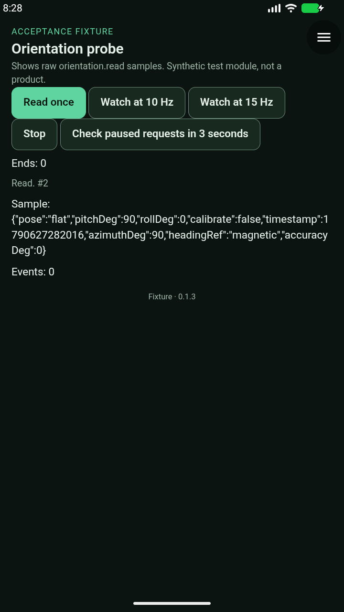
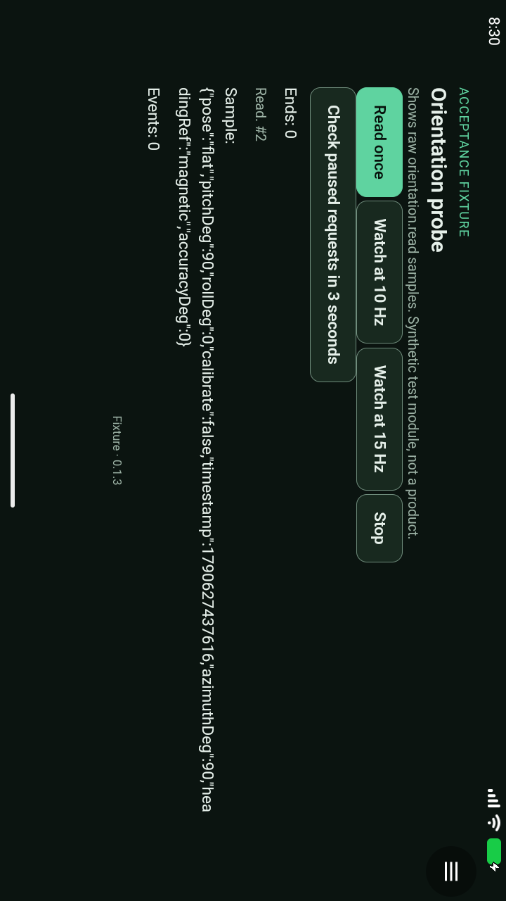
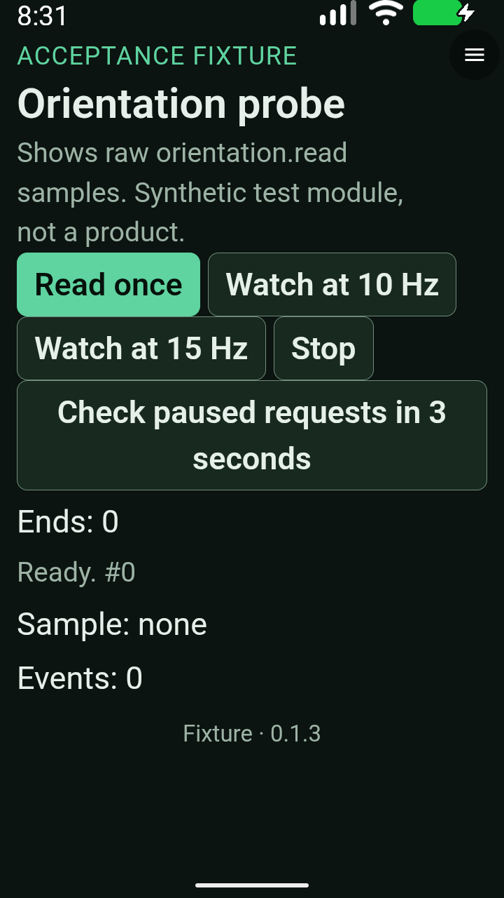
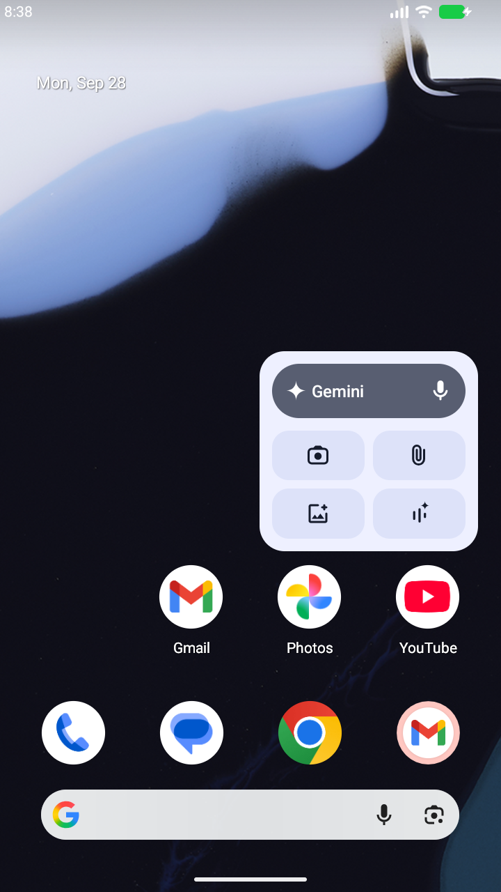
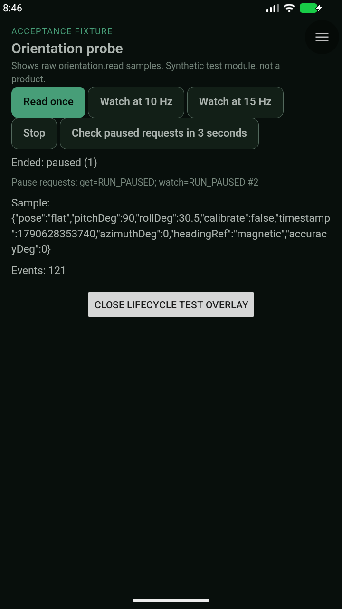
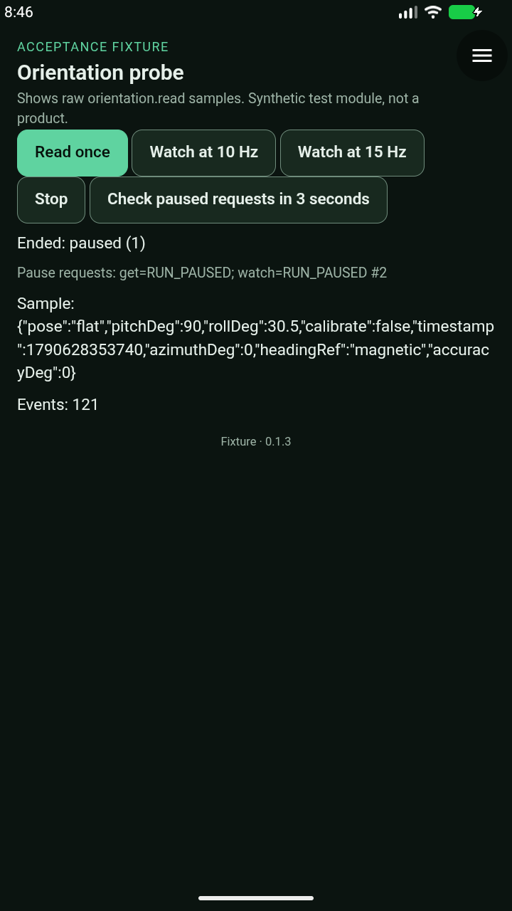

# API 0.14 orientation — alpha36 staging

**Held: top-resumed foreground follow-up and full Android acceptance required.**
This is not hardware clearance. [#51](https://github.com/blueworkslabs/construct/pull/51)
and its [#42 base](https://github.com/blueworkslabs/construct/pull/42) remain unmerged;
Space Watch follow mode #52 remains deferred. Production modules are unchanged.

## Review changes and checks

Host source: `05de64b79e2a7fb8a2ba052d33cf39dcd7f9a79a`, **alpha36 / versionCode 36**.
The held [alpha35 result](orientation-alpha35-staging.md) remains historical evidence.

- Activity pause cancels orientation and denies new requests without waiting for onStop.
  Resume does not restart a watch. Terminal events are separate from menu visibility events.
- Queued native replies use an independent activity epoch, including pause→resume races.
  Newly created WebViews inherit the activity's current state.
- Sensor measurement time replaces callback wall time. Invalid/future or >250 ms old
  readings are discarded, with the existing 2 s read timeout.
- Native authorization applies immediately before handoff to WebView. Data already
  released to an authorized renderer cannot be recalled if its JavaScript is busy;
  no renderer-execution-time atomic revocation is claimed.

**258 JVM tests, lint, 35 package tests, 92 runner-helper tests and architecture checks pass.**
The freshness change first exposed five fixture failures: Robolectric rounded away
an added nanosecond, leaving synthetic sensor time ahead of its millisecond clock.
The fixture clock was corrected, without weakening the production freshness gate.

Both optimized APKs passed existing-signer identity, publisher-key identity, 16 KB
alignment, ABI/native-library and bundled-model checks. Draft-release downloads
were fetched back and matched these exact hashes:

- ARM64: `c5cf72d2fe307bf5df68078ef2eb8b11e12d8626a46b4467055b08f6d3773496`
- x86-64: `12d846811e2210b80553d529b307e5b7c08ecd99a398ee7f48e4c435f2718a8b`
- Signed Orientation probe **0.1.3**: `7ddfcef340238db112eae99f255fec5e1beb02061f29308d5a9e7c6ed85b51ea`
- [Isolated probe catalog](https://raw.githubusercontent.com/blueworkslabs/construct/01c8065a1fd773509b8844fb966d20aed5de417b/catalog/candidates/orientation-probe/index.json)
  (served ZIP hash and publisher signature verified).

The alpha36 draft APKs are explicitly **HELD**, not published or recommended for phone use.

## Android runs — do not combine into acceptance

All runs use the same alpha36 x86-64 APK and signed probe 0.1.3 on a disposable API 37
emulator. Sensor input is synthetic acceleration/magnetic-field/gyro data, fused by
Android; direct rotation-vector injection is unavailable. The reported synthetic
accuracy of 0° says nothing about physical compass accuracy.

[Sanitized receipts and original-image hashes](evidence/orientation-alpha36-staging-2026-09-28.json).

### Full run 1: 8/9, invalid pause-only stimulus

`20260928T202609Z-orientation-0678f6b7`, runner `05de64b`.

Passed signed installation/native opt-in denial, flat north/east, upright bearing and
positive pitch, 10/15 Hz bounds/Stop, menu pause, revocation, Home/restart, landscape
and 200% text. Native connections were 1 while watching, 0 after Stop/menu/revoke/Home.
The full landscape reading and enlarged-text controls were visually inspected.
The enlarged-text capture is before its subsequent successful Read/Stop, not a
capture of the enlarged sample itself.

The last stimulus opened Android's Internet panel, but the module was **RESUMED**,
not paused. The driver correctly refused to count this as pause-only coverage.
The run stopped cleanly. It is not 9/9.

### Full run 2: 6/9, Home listener assertion failed

`20260928T203427Z-orientation-b8cc6113`, runner `f427572`.

The first six gates passed. At the Home gate, native sensor-service output still
showed one active rotation-vector connection for the app UID, with sensor access
and queued events. The retained activity record was STOPPING; Launcher was visible.
Logs also show top-resumed-loss timeout and a delayed focus callback (~2.3 s).
These observations establish a failed bounded acceptance gate, **not** a proven
persistent leak after the application's onPause callback completed. They must not
be dismissed by the earlier passing Home observation.

Restart/layout and the new translucent-activity gate were not reached in this run.
The emulator stopped cleanly.

### Focused pause-only diagnostic

`20260928T204330Z-orientation-99315f29`, runner `dfebdc2`: **2/2 focused checks pass**,
complete=true, stopped=true; emulator service independently inactive.

The permission-free test activity left the module's system record PAUSED and its
client Activity at `mResumed=false mStopped=false`. Native sensor connections were
**0 while paused and 0 after returning**. Delayed get and watch both returned
`RUN_PAUSED`. Exactly one `Ended: paused (1)` notification appeared, sample counts
stayed stable, and only an explicit fresh watch restarted sampling.

The original activity-pause finding is therefore closed for this tested path. This
is a focused diagnostic, **not 9/9 acceptance** and not coverage of multi-resume
loss of top-resumed status. An earlier focused attempt (`20260928T203941Z-orientation-ca9083e4`)
stopped at 1/2 because the driver's parser assumed one space in Android's `Hist  #`
record. Retained system/client dumps showed the correct pause-only state. The parser
was corrected with positive/negative tests, and this fresh run passed. Both stopped
cleanly; no host or signed-probe bytes changed between attempts.

## Remaining source finding

[Independent review](https://github.com/blueworkslabs/construct/pull/51#discussion_r4126792819)
identified a separate multi-resume gap. `onTopResumedActivityChanged(false)` updates
only the privacy curtain. On Android Q+ another visible app can become top-resumed
without pausing Construct, leaving orientation eligible. The existing privacy-curtain
regression explicitly treats resumed-but-not-top-resumed as not foreground.

[Implementation handoff](https://github.com/blueworkslabs/construct/pull/51#issuecomment-5878110982):
combine resumed/top-resumed eligibility on Q+ with the older-Android fallback;
stop and deny on eligibility loss; preserve callback ordering, late-view initialization,
independent menu/picker handling and exactly-once terminal events. Regaining eligibility
must not silently restart watches. Add regression and Android coverage, then a fresh
versioned candidate and full acceptance.

## Limits

No hardware compass/calibration or Space Watch follow-mode acceptance. Picker
independence has source/JVM coverage, not an end-to-end camera/gallery rerun here.
Retained emulator logs contain the recurring Bluetooth startup SIGABRT; no Construct
fatal exception was found. This is not a globally empty crash-buffer claim.

## Original Android captures

The receipt associates each image with its exact run; these are unmodified emulator
console PNGs, not browser previews. The landscape PNG retains the console's rotated
pixel orientation.

