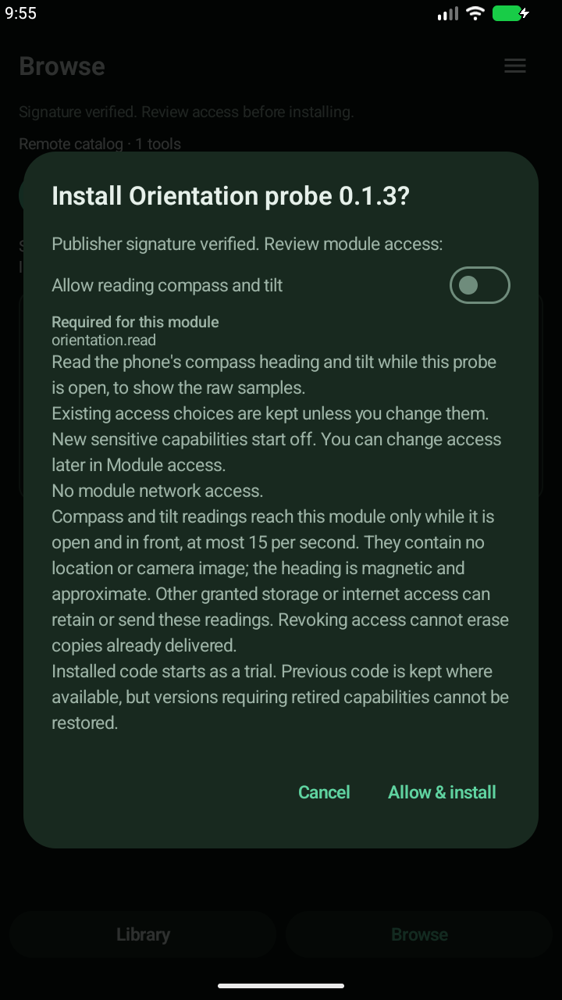
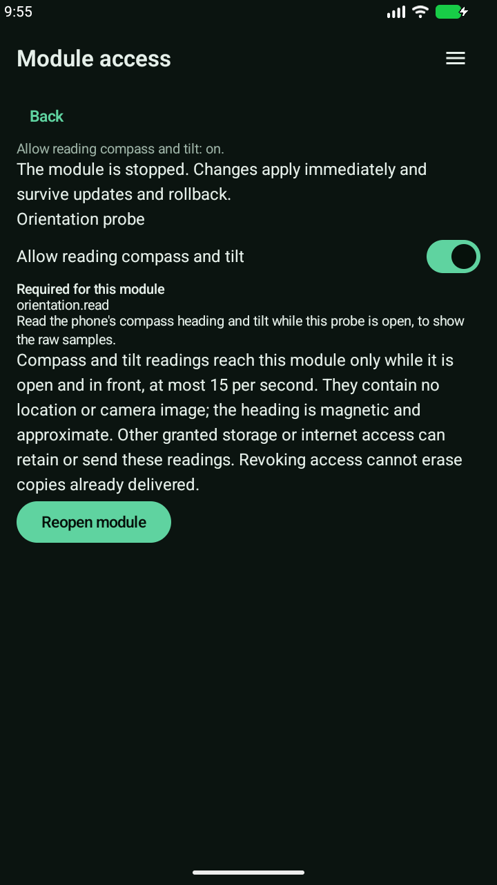
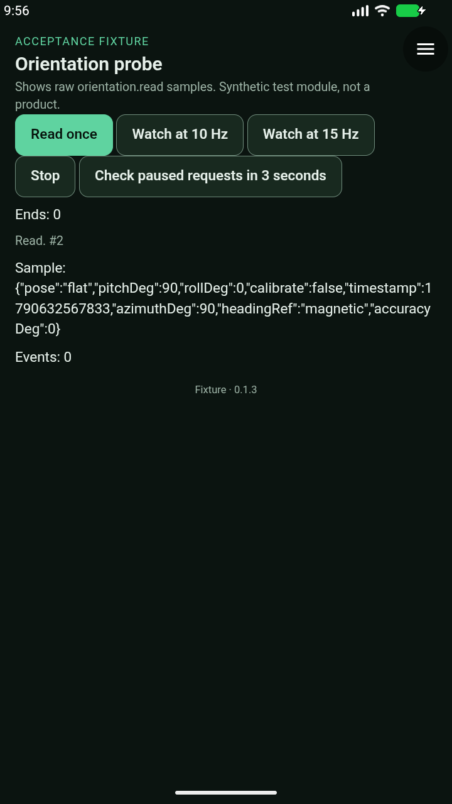
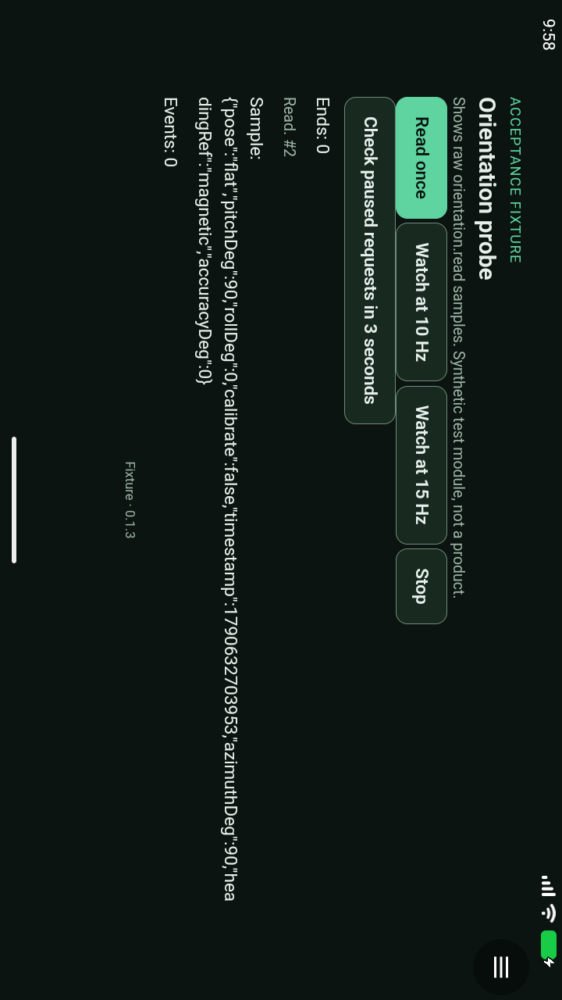
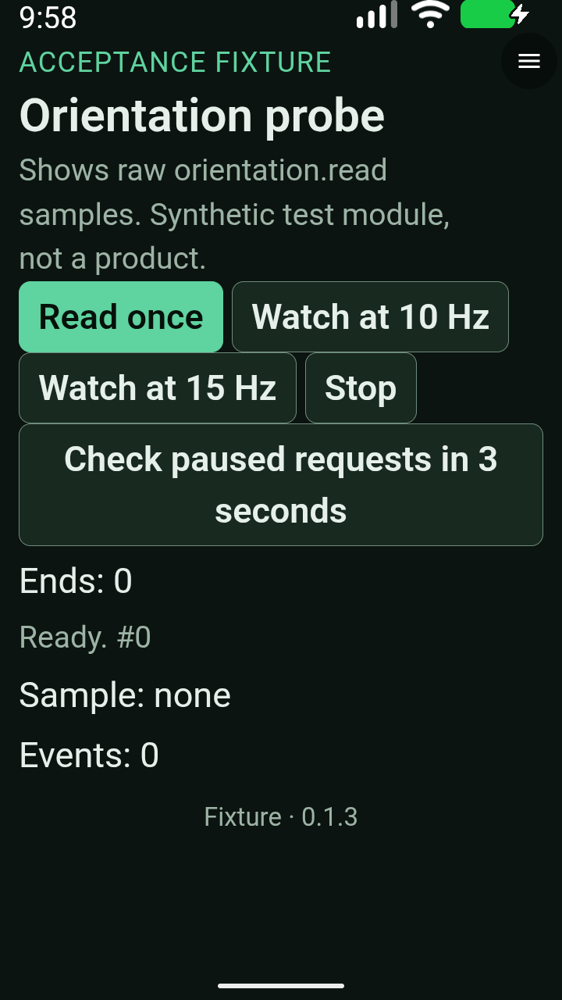
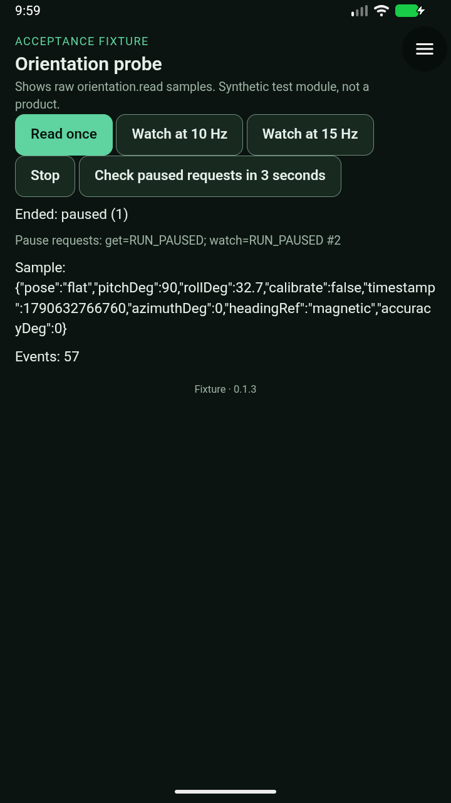
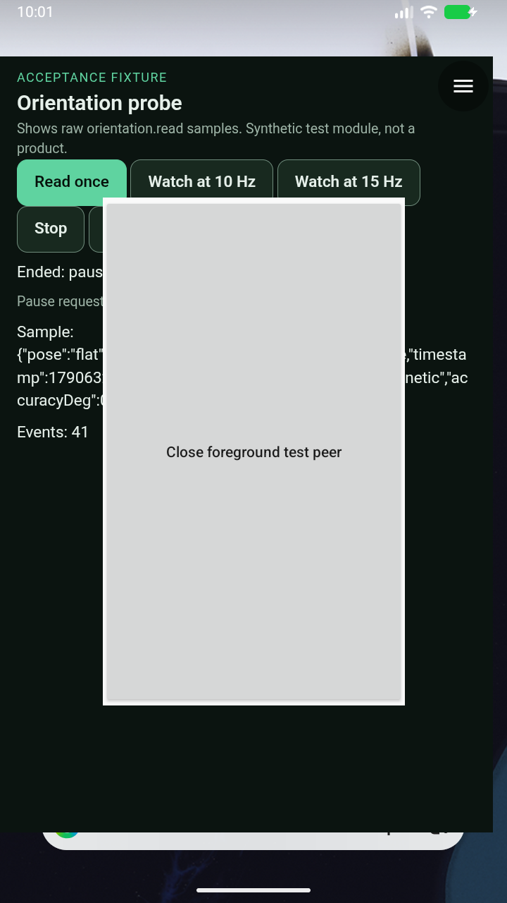
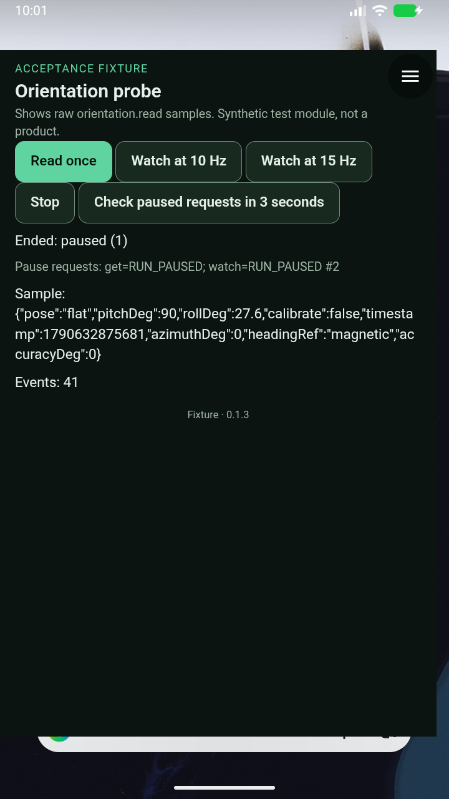

# API 0.14 orientation — alpha37 staging

**Review and Android acceptance complete; ready for physical-phone checks.**
[#51](https://github.com/blueworkslabs/construct/pull/51) and its
[#42 base](https://github.com/blueworkslabs/construct/pull/42) remain unmerged.
This is not a production release or acceptance of Space Watch follow mode #52.

## Exact candidate and review

Host source `4e7f53478fab0f21c75b315691f3ea749cb845e6`, **alpha37 / versionCode 37**.
The final candidate includes Fable's resumed/top-resumed eligibility fix and these
bounded review corrections:

- Window focus is also required, covering Quick Settings without onPause.
- Native install and Module access disclose retention/transmission by other grants
  and that revocation cannot erase delivered copies.
- One-shot reads and watch events share a persistent 15 Hz delivery budget.
  Stop/restart does not reset it; each watch also retains its selected rate cap.

Ineligible transitions stop sampling, deny get/watch and invalidate queued native
replies. Regaining eligibility never restarts a watch. Menu and picker gates remain
independent. Pre-Q uses resumed plus focus, without a top-resumed callback.
Measurement-time freshness enforcement remains intact.

**262 JVM tests, lint, 35 package tests, 93 runner-helper tests and architecture
checks pass.** Both optimized APKs passed existing-signer/publisher identity,
16 KB alignment, ABI/native-library and bundled-model checks. Draft-release APKs
were downloaded back and matched the verified candidate hashes:

- ARM64: `9e47fa6467095993372476b30615b95a03f7e20b48b759d531d74dc1f8ff7862`
- x86-64: `23cd4b27f95fbc0124fbb6cf69af4d80a6cc8534c58e2235b95e24f4526b5477`
- Signed Orientation probe **0.1.3**: `7ddfcef340238db112eae99f255fec5e1beb02061f29308d5a9e7c6ed85b51ea`

[Phone install/checklist](orientation-alpha37-hardware-check.md).
Earlier held alpha35/36 APKs are not the candidate. Broader GitHub Android-build CI
was still pending when this report was prepared; local build/acceptance is distinct.

## Exact-APK Android acceptance

Run **`20260928T215416Z-orientation-9c0d6cd8`**, runner `0798c42`:
**11/11 passed, complete=true, stopped=true**. Runner exit 0; emulator service
independently confirmed inactive. Disposable API 37 emulator, verified installed
x86-64 APK and signed probe digest. No host or probe changes during the run.

[Sanitized receipt and original-image hashes](evidence/orientation-alpha37-staging-2026-09-28.json).

1. Signed installation and native opt-in denial for get/watch.
2. Flat north/east from injected magnetic-field inputs.
3. Upright camera bearing and positive pitch.
4. 10/15 Hz watch bounds and explicit Stop.
5. Native-menu pause, with no restart on return.
6. Grant revocation and denial after reopening.
7. Home, close/process restart and persisted grant without watch resurrection.
8. Landscape and 200% text, with working Read/Stop.
9. Translucent activity: system PAUSED, client `mResumed=false mStopped=false`.
10. Quick Settings: system RESUMED, client resumed/not stopped but unfocused.
11. Real freeform peer: Construct remains RESUMED/in multi-window, while the peer
    is the global resumed activity/current focus; Construct is unfocused.

Native sensor connections were **1 while watching, 0 after Stop, menu pause,
revocation, Home, activity pause, focus loss and top-resumed loss**. The last three
cases each returned `RUN_PAUSED` for delayed get/watch, showed exactly one terminal
pause event and stayed at zero listeners/stable event counts after returning.
Only a fresh explicit Watch restarted sampling.

The Home check observed the client's lifecycle transition in **1.792 s** (8 s
bound), then measured zero listeners. This does not claim zero wall-clock latency
from a Home keypress, or reinterpret the earlier alpha36 failures as passes.

### Earlier attempt, retained separately

`20260928T214921Z-orientation-eec9713c`, runner `37dda2b`, stopped cleanly at **0/11**.
The driver incorrectly required the fixed dialog action inside the disclosure's
scroll viewport. The retained capture showed readable consent and an accessible
Allow & install button. The locator was corrected in `0798c42`; the full run above
used the same host and probe bytes. This failed attempt is not combined into acceptance.
The [alpha36 report](orientation-alpha36-staging.md) remains historical evidence.

## Limits and capture interpretation

- Inputs are synthetic acceleration/magnetic-field/gyro readings fused by Android;
  direct rotation-vector injection is unavailable. Synthetic accuracy 0° does not
  establish physical compass accuracy or calibration.
- Multi-resume used **freeform**, not the split-screen UI. Native state evidence,
  not the visual overlap alone, establishes that Construct remained resumed.
- Combined get/watch burst limiting has JVM coverage, not an Android bridge flood.
- Picker independence has source/JVM coverage, not a fresh end-to-end gallery/camera run.
- Native authority applies at handoff to WebView. Already released data cannot be
  recalled from a busy renderer.
- Original console PNGs were inspected for consent, portrait/landscape, enlarged
  controls and lifecycle results. The landscape image retains its rotated pixel
  orientation. The enlarged-text capture precedes the successful Read/Stop, so it
  shows controls rather than an enlarged populated sample.
- Logs contain the recurring emulator Bluetooth startup SIGABRT; no Construct fatal
  exception was found. This is not a claim of a globally empty crash buffer.

## Original Android captures

