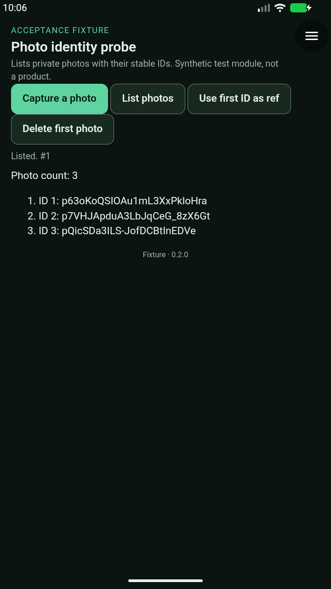
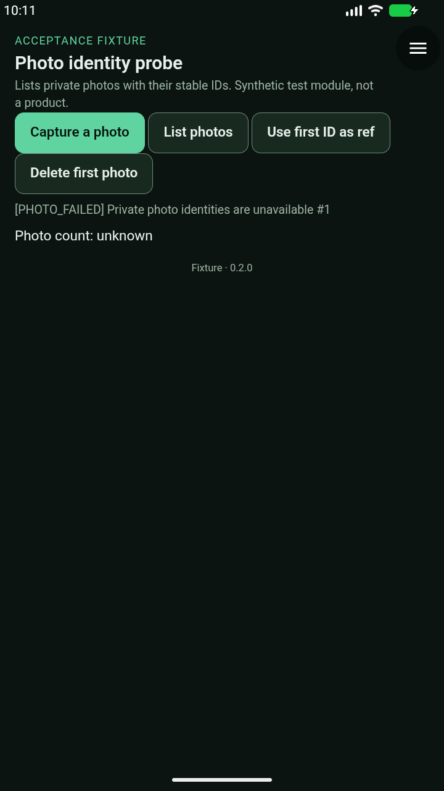
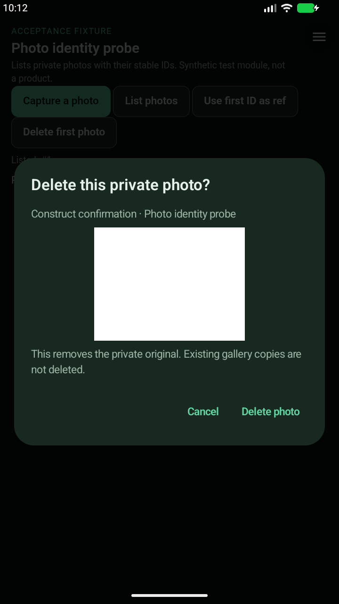
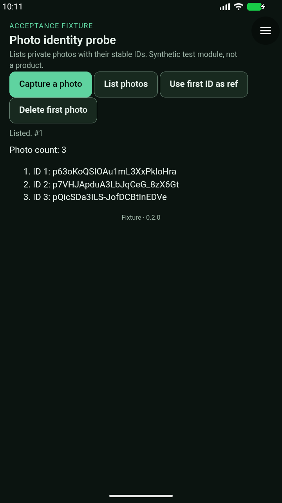
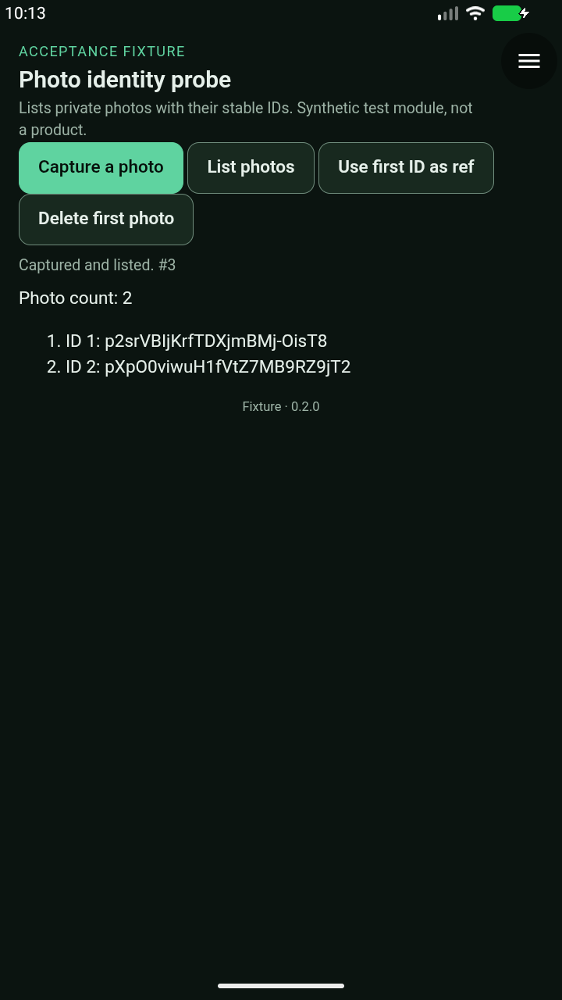

# Stable photo identity — alpha32 candidate acceptance

**Review and staging passed; physical-phone feedback pending.** No merge or APK release is recorded by this receipt. Aimé itself is not part of this slice.

## Exact artifacts

- Host source: `2c132c9eeafd2b7757243c178efb190466bf2c94` (native fix `64c27c8`; later commits are runner/fixture/evidence only).
- Accepted runner: `a82d2d77443ee164aeb32c1ec4e090c6fa81202e`.
- Android 17 / API 37, x86-64, WebView `155.0.8059.0`; disposable synthetic-camera snapshot.
- Run: `20260926T220109Z-photo-identity-a2c93e23`; **13/13 checks, exit 0, stopped=true**. Emulator independently confirmed inactive afterwards.
- Both optimized APKs are versionCode 32 / `0.1.0-alpha32`, have the same signer as alpha31, and pass size, 16 KB alignment, native inventory and pinned model/runtime verification.

- arm64-v8a: `construct-0.1.0-alpha32-arm64-v8a-2c132c9.apk` (23806330 bytes), SHA-256 `2c92671f26e6accc31bf8ff6a66ffb4824949a7cda8d6745c53e6830cb74b9ea`.
- x86_64: `construct-0.1.0-alpha32-x86_64-2c132c9.apk` (26689915 bytes), SHA-256 `8c92858b02d6ea5a2a648eca8e9a7d94bb9870cbd6b11edcff708e3b479d3627`.

[Sanitized receipt](evidence/photo-identity-alpha32-2026-09-26.json). Raw synthetic run receipts remain operator-local.

## Acceptance

- Denied listing publishes no IDs before grants.
- Android camera permission remains independent of the module grant.
- API 0.11 module keeps the legacy list shape and allocates no identity.
- Update to API 0.12 backfills distinct IDs for legacy and byte-identical originals.
- IDs are unchanged across repeated list and process restart.
- A stable ID is rejected as open authority.
- IDs survive signed module update and rollback on identical APK bytes.
- Revoked library grant lists nothing; restored grant returns the same IDs.
- Identity truncated fails closed; restoring metadata returns the same IDs.
- Identity same-size corruption fails closed; restoring metadata returns the same IDs.
- Identity missing established key fails closed; restoring metadata returns the same IDs.
- Deletion retires an ID; recapture receives a new ID.
- Native clear-all retires IDs; new captures never reuse them.

The three [signed fixtures](https://1e54f55f.construct-20x.pages.dev/fixtures/photo-identity/index.json) were verified over HTTPS against the local package hashes and embedded publisher key. They are isolated from the production catalog index.

Local checks: **197 JVM tests**, including 10 photo-identity tests; **71 runner tests**; 32 Python source checks; 12 Camera-module checks; server and architecture checks. Lint passes with 21 warnings and no errors. GitHub PR build [36272186738](https://github.com/blueworkslabs/construct/actions/runs/36272186738) passed for the exact APK source. Later runner/evidence-head CI is separate.

## Review fixes and unsuccessful attempts

Codex review found that same-size key corruption or loss of an established key could silently assign new IDs. The corrected implementation uses a checksummed record and durable initialization fingerprint, and retries failed directory durability barriers before publication. Focused re-review is clear.

The first local assembly stopped on an absent prepared OpenCV source after JVM/lint passed. Restoring the checksum-pinned source allowed the complete pilot build; no application change was required.

- Attempt 1: failed after one check because the driver skipped an off-screen Android camera grant. The host correctly returned `ANDROID_PERMISSION_DENIED`.
- Attempt 2: passed ten checks, then stopped when the ADB root command closed its initiating transport. A bounded helper now verifies the actual resulting identity; command success alone is insufficient.
- Attempt 3: deliberately interrupted before its first completed check to correct a later off-screen clear-all status assertion found during driver inspection.
- All three remain separate, incomplete receipts with clean emulator shutdown. No partial results were combined into the accepted run.

## Scope and next check

Cross-module isolation and post-rename directory-sync failure injection are JVM checks, not emulator claims. This is targeted photo-identity acceptance, not a full new host regression or Aimé acceptance. Physical-phone upgrade from alpha31, real camera use and existing-data preservation await pilot feedback.

For the phone check, install the ARM64 candidate over alpha31 without uninstalling. Confirm existing modules/photos remain, then use probe 0.2.0 from the fixture catalog: capture two harmless photos, verify IDs after reopening, mark working, update to 0.3.0 and roll back. IDs should persist; deleting and recapturing should allocate a new one. The ID-as-ref action must fail. Do not run the emulator root/corruption script on a phone.

## Reviewed screenshots

These are unedited console captures of the synthetic emulator. The host retains `FLAG_SECURE`; ordinary ADB captures are intentionally black.

