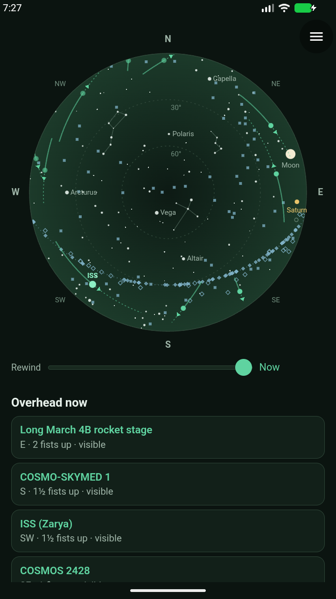
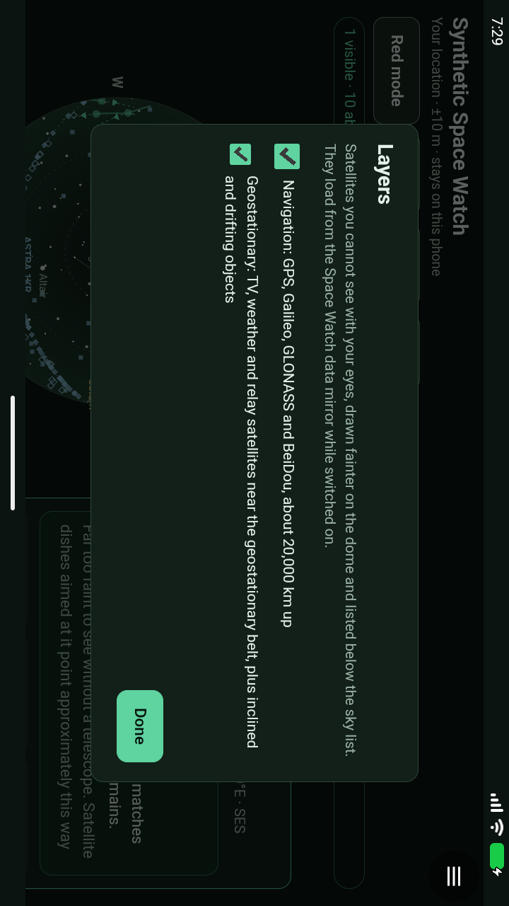
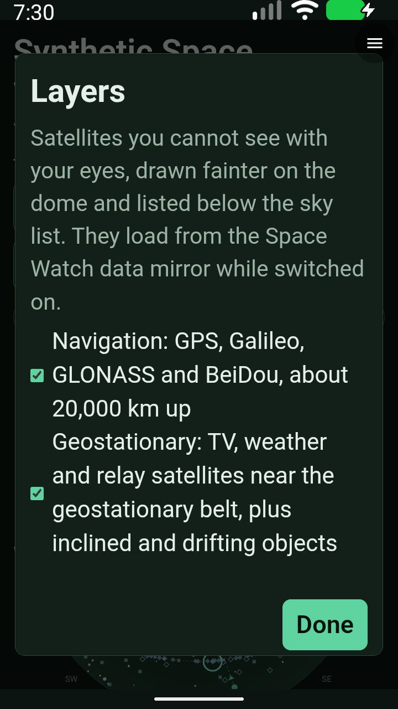
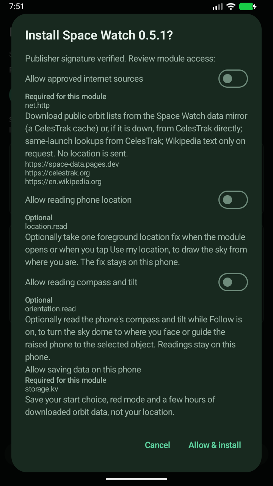

# Space Watch 0.5.1 mirror and layers staging

Status: **31/31 functional Android gates passed; ready for physical-phone checks.**
**Teardown caveat:** the emulator aborted during requested shutdown after all
checks completed. It is stopped, with no emulator process remaining; this is
not a clean-exit receipt.
No merge, APK release or production-catalog promotion is included.

## Ownership and exact artifacts

Module-owned mirror validation/fallback, orbit classification, layers and guidance
use the existing API 0.14 host. Alpha37 retains native networking consent,
orientation lifecycle and bounded storage. The new `space-data.pages.dev` origin
widens `net.http` scope; no host code or APK change is required.

- Author correction: `8f7bf65`; reviewed refinements: `b0c112d`.
- Signed artifact commit: `03a2490`.
- Real 0.5.1 SHA-256: `bb5f783b5398a72b5eb9751366f7ec86def7d1bb6b52b3a7d356492ee85939ea`.
- Fixture SHA-256: `b99cce2aa7c8424a01df427fbe2cae2da2a97d09524a76e94c6d95b7712dd619`.
- Unchanged 0.4.1 upgrade baseline: `10dcb4fc379af3606a32f227cafc68f1f77d98c01ab581724975b2eb7aad9e83`.
- Unchanged alpha37 x86_64 APK: `23cd4b27f95fbc0124fbb6cf69af4d80a6cc8534c58e2235b95e24f4526b5477`.

All three served packages have verified hashes and publisher signatures.
Synthetic Space Watch substitutes a running fixture clock, Berlin viewpoint and
saved provider lists; native orientation/storage and live lookups still use the
host. Real-module consent, loading and offline gates are separate.

## Review and local results

- Empty/duplicate mirror rows fall back rather than replacing good data.
- Interrupted layer downloads restore their retry state; in-flight toggles do
  not duplicate requests.
- GEO-group membership does not imply a stationary orbit. BeiDou IGSO-6 moves
  over 30° in elevation in six hours and now has ordinary motion/rise wording.
- The initial ≤5° / ±2% mean-motion classifier still called ELEKTRO-L 3 parked
  despite about 3.1° longitude drift/day, and called horizon-crossing GS-1
  permanently below the horizon. The revised conservative display heuristic
  uses sidereal rate 1.0027379 ±0.0005 rev/day, inclination ≤1° and eccentricity
  ≤0.001. This is not proof of station keeping; even filled diamonds stay
  **near** a spot, dish guidance is approximate, and no object is said never
  to rise solely from this classification. Fixture counts: 119 parked,
  63 inclined, 8 drifting/eccentric.
- Cached layer composition deduplicates after asynchronous downloads, so an
  object in both lists appears once even when navigation completes later.
- 24 orbit/model groups, controller regressions, real-browser UI/layout checks,
  19 package/publisher tests, 99 Android-runner helper tests and architecture
  checks pass. The new drift regression fails on the prior classifier.

Review and fixes assisted by Codex. Emulator checks cannot establish physical
compass accuracy, sky alignment, precise dish alignment or real TalkBack behavior.

## Consent and fallback are different tests

On alpha37, declining the widened origin scope disables **all** `net.http`,
including CelesTrak. Per-origin approval is not supported. Saved orbits remain
usable. The native upgrade gate tests old approval invalidation, denial and
regrant. Mirror-down/malformed/stale-index fallback is tested separately in the
controller; it is not evidence of selective native source approval.

## Android run

- Run: `20260930T072500Z-space-179a761b`, 2026-09-30 07:25–07:55 UTC.
- Runner: `02a0b00dc3a1d3f40912f3264541728ea2baecec`.
- **31/31 functional gates passed in this run**, with the exact signed bytes above.
- [Sanitized receipt and original-capture hashes](evidence/space-watch-0.5.1-staging-2026-09-30.json).
- [All 50 original Android captures](images/space-watch-0.5.1-staging/).

Coverage includes both layers loading from the fixture mirror, ASTRA selection,
landscape and 200% text, on/off persistence, native Follow/pointing/lifecycle,
pass/train preview, explicit live lookups, restart, the **real 0.4.1→0.5.1
scope upgrade**, denial, regrant without Refresh, and offline reopen with Wi-Fi
and mobile data disabled. Native sensor listeners were one while watching and
zero on denial, Off, menu pause, focus loss, revocation and process restart.

The live data status was `Orbit data 15 h old · CelesTrak`; live and offline
views both showed `0 visible · 8 above you` at Now. This is the orbital-element
age, not proof that a mirror index was stale. The native result confirms live
loading, not which upstream path supplied it; mirror fallback is independently
covered by controller fixtures.

### Shutdown and environment caveats

The runner recorded `complete=true`, `stopped=true`, but independent systemd
inspection found `Result=core-dump`, `ExecMainStatus=6`, `MainPID=0`,
`ActiveState=failed`. The journal places SIGABRT at **07:55:00 during requested
emulator shutdown**, after the final checks, not during module operation. A
process check found no remaining emulator. No clean teardown is claimed.
The guest crash buffer separately contains the emulator's system Bluetooth
abort at startup, not a Construct application exception.

Earlier attempts remain incomplete, not pooled into the 31/31 result:
0.5.0 stopped at 21/31; initial 0.5.1 attempts stopped at 1, 1, 1, 5, 7 and 3
gates. Fixes were a named native checkbox, XML-leaf lookup regression, unique
Layers toolbar targeting, dialog-ready capture waits and a bounded guidance
scroll. One interrupted attempt relaunched/stopped the module when rotation
and text size changed together; the final driver settles rotation before the
separate text-size change. The earlier [0.5.0 report](space-watch-0.5.0-staging.md)
remains separate.

This WebView exposes named `android.widget.CheckBox` nodes but reports
`checkable=false` and `checked=false` even for visibly checked controls.
The driver verifies visible on/off announcements, drawn layers and persistence
instead. Browser accessibility-role checks pass; **real TalkBack checkbox-state
announcements remain a phone check**, not an emulator claim.

### Inspected native captures

The final-run layer controls, ASTRA details, pointing guidance, train attribution,
consent and live/offline captures were inspected. Screenshots are original
emulator-console PNGs, not browser previews. Fixture details may show an element
epoch as “tomorrow” because saved GEO rows are newer than the running fixture
clock; they are not presented as fresh real-world alignment measurements.

[Phone checklist](space-watch-0.5.1-hardware-check.md). PR remains open;
production and the host APK are unchanged. Broader Android CI was still running
at handoff; this is not a release or merge clearance.
