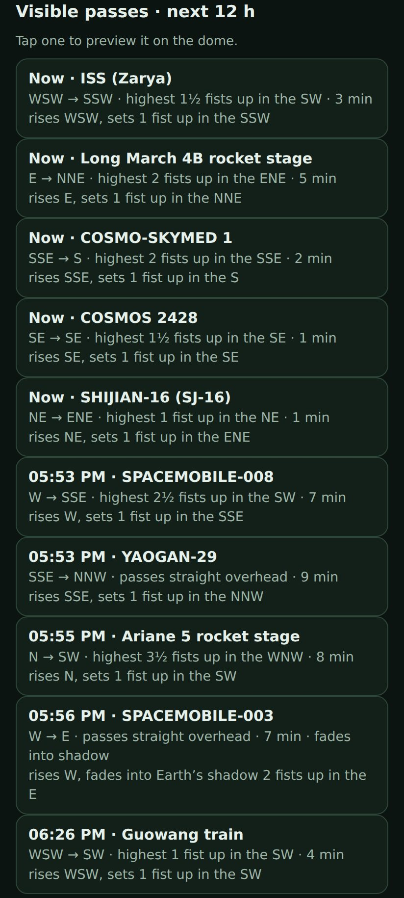
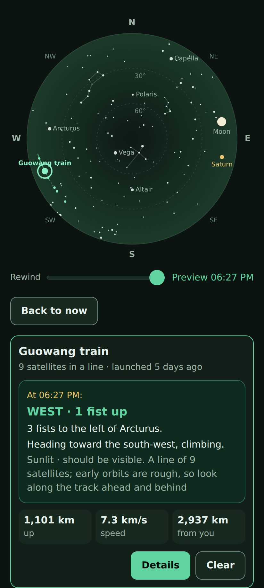
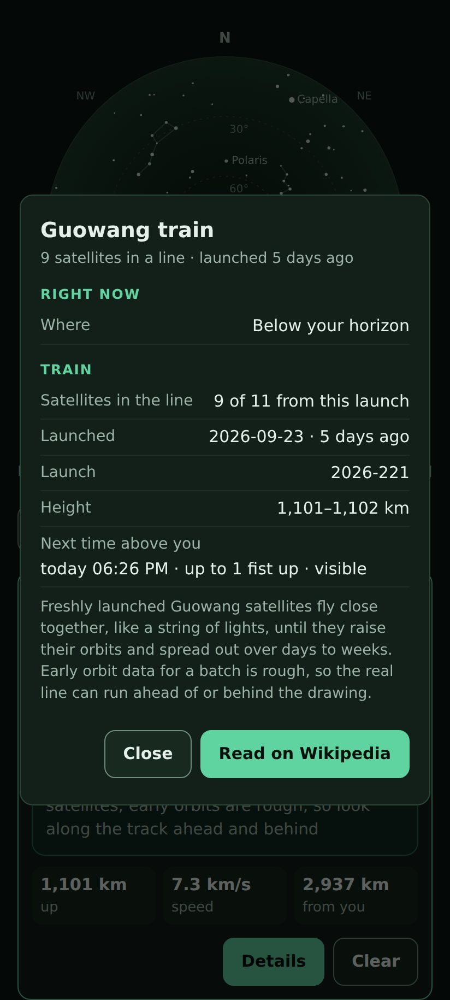
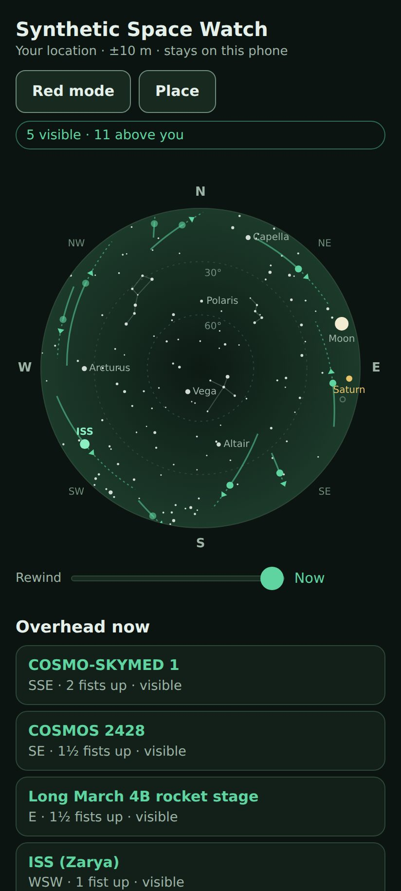
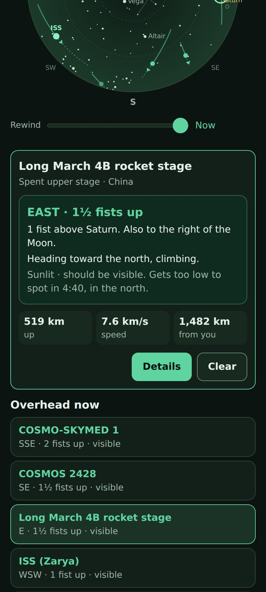
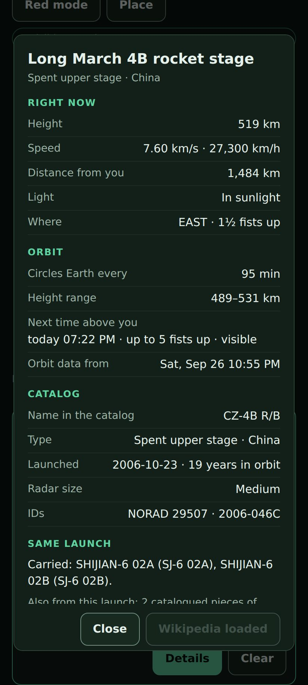
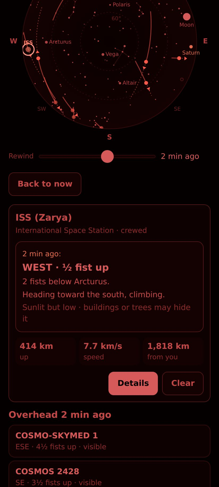
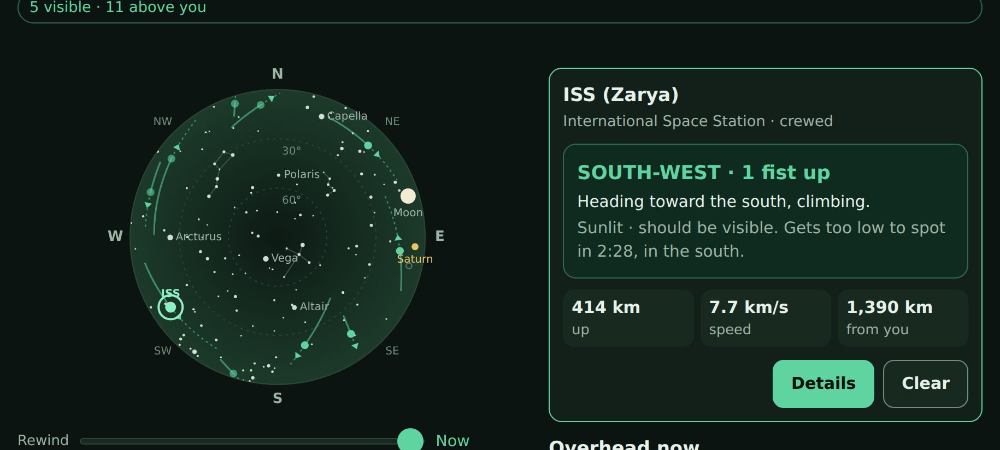

# Space Watch — what's passing overhead

Space Watch **0.2.8** is a signed HTML/CSS/JavaScript module for host **API 0.9 /
alpha26** and later. It draws a sky dome of CelesTrak's brightest orbiting objects
(the ISS, Tiangong, Hubble, rocket stages and other satellites that sunlight makes
visible). It tells you where to look in plain words and shows what each object is.
Positions are computed on the phone. **The location never leaves the device.**

It is a sibling of [Sky Watch](sky-watch.md) (aircraft), not a layer in it.
Aircraft are a 10–100 km map question. Orbiting objects are seen from well over
1,000 km away and cross a 100 km circle in about 25 seconds, so they need a sky
view, not a map.

## Module 0.2.0: visible passes and trains

Both features are module-only, with no host change, no new origin and no new
consent. 0.1.6 stays published unchanged. 0.2.4 was the reviewed candidate after
the initial 0.2.0 package; 0.2.8 adds the grazing-pass refinement below and
needs its own acceptance.

- **Visible passes · next 12 h.** This lists passes of the bright objects (and
  trains) that should be visible from your place, soonest first, at most 10.
  - Each entry shows the time, or **Now** while one is under way. It gives the
    direction from and to, the highest point in fists and its direction, and the
    duration.
  - It also says how the pass begins and ends: "rises", "comes out of Earth's
    shadow" or "appears as the sky darkens"; "sets", "fades into Earth's shadow"
    or "fades in the brightening sky". Clipped intervals say "already visible"
    or "still visible at window end", rather than inventing a rise or set.
  - **Tap one to preview it:** the dome, the list and the spot card jump to 20 s
    after it becomes visible (or the midpoint of a shorter interval) and run on in real time. The spot card says
    "At 18:27:", the label says **Preview 18:27**, and **Back to now** returns.
  - **How it is worked out:**
    - Dark stretches (Sun below −6°) are found first on a 10-minute grid.
      Solar minima and boundary intervals are refined to about one second so
      a short polar-twilight dip cannot fall between samples. Satellite scans
      are restricted to the resulting dark ranges.
    - A 30-minute look-ahead buffer preserves the full rolling 12-hour
      displayed horizon between recalculations.
    - Each object is then scanned every 60 s for rises above 10°, refined to
      5 s, and the visible stretch is sampled every 5 s.
    - **Grazing passes (0.2.8).** A pass that peaks just above 10° can fit
      between two 60 s samples. The 0.2.4 review found one: SL-14 R/B 16792
      from 49.5° N at 00:42:20–00:42:35 UTC, peak 10.01°. So every coarse local
      maximum within 4° of the 10° line is refined; the first and last
      scan intervals are also checked when close to that line:
      - the peak is found by golden-section search to about 1 s;
      - if it reaches 10°, the stretch is sampled every second.
      - Why 4°: within 60 s of its peak, a low pass drops only about 1°.
      - The author’s initial adaptive-refinement benchmark checked a 5 s
        reference scan: 156 objects × 8 places over a
        12 h night gave the same 1,466 passes. Plain 60 s scanning missed 7 of
        them. The refinement costs about 0.6% more propagations; the 5 s scan
        would cost about 10×.
    - The work runs in slices of about 15 ms between frames, with a progress
      line. It is redone after 30 minutes, a new place, new data or changed train membership.
    - The ISS pass of 28 Sep over Berlin again matches Heavens-Above to within
      10 s.
- **Trains.** Freshly launched Starlink, Qianfan, Guowang, Kuiper and OneWeb
  batches fly as a line of lights for days to weeks.
  - **Source:** CelesTrak's `GROUP=last-30-days` orbits and SATCAT, about 77 KB
    and 69 KB as of 2026-09-28.
  - **What counts as a train:** at least eight satellites of one family from one
    launch, still within 10° of one of them as seen from Earth's centre.
    Elements more than 72 hours from the displayed real clock do not contribute
    to a train; membership is rechecked each minute. Spread-out batches drop out.
    The retained fixture qualifies Guowang 2026-221 (9 of 11, launched 23 Sep).
    Its 23 clustered Starlinks from 2026-219 share eight-day-old launch elements,
    so that batch is excluded instead of advertised as a current train.
  - **How it is shown:** a train is one entry, e.g. "Guowang train · 9 satellites
    in a line · launched 5 days ago". Its cluster representative gives the pointing
    words, and the other members are small beads on the dome.
  - **Honest note:** early orbit data for a batch is rough, and CelesTrak often
    gives a whole batch one shared set of elements. The card therefore says to
    look along the track ahead and behind.
  - **Details:** how many satellites are in the line out of the batch, the
    launch date and days since, the height range, the next time above you, why
    trains happen, and Wikipedia for the family article (Starlink, Qianfan,
    Guowang, Project Kuiper, OneWeb).
  - **Downloads:** the recent lists are fetched with the orbits (8-hour
    freshness, 15-minute spacing, 2-hour back-off on 403/429 or bad data). Only
    batches that currently contain a qualifying train are cached (`recent.*`),
    including their stragglers so the original batch count survives reopening,
    plus launch dates (`recent-launches`). Storage remains subject to the host
    64 KiB quota.
  - **Failure:** trains are optional. If the recent lists fail, the rest of the
    sky and its status line are unaffected. Invalid or partially malformed replies retain the previous
    train snapshot and back off for two hours; valid empty lists remain fresh
    across reopening.

Original browser previews of Synthetic Space Watch 0.2.0 (desktop Chromium,
not Android; pre-review wording and stale-train policy):

## Ownership and delivery

| Owned by the module (ships as a module update) | Host (unchanged) |
| --- | --- |
| Orbit maths (SGP4), visibility, Sun/Moon/planet/star positions | `net.http` with fixed origins, size/time limits, no redirects |
| CelesTrak and Wikipedia parsing, validation, cache format | `location.read` (one foreground fix) |
| Dome rendering, list, pointing words, details, red mode | `storage.kv` (64 KiB quota) |
| Curated names for famous objects and rocket-stage launchers | Consent, grants, lifecycle, isolation |

- **APIs:** only implemented ones are used: `net.http`, `location.read` and
  `storage.kv`, all 0.9. There is no new host capability and no APK change.
- **Future follow mode:** turning the dome with the phone needs a live,
  foreground-only orientation stream. The Aimé brief already plans a one-shot
  `orientation.read` with a "later live mode". That would be a separate, shared
  host contract. The dome renderer has a `rotation` input reserved for it; the
  module does not claim or emulate it.

## Interaction

- **Opening.** With both location switches on in Module access, opening takes
  **one foreground fix** and shows the sky. Without them, or with **Start with my
  location when opening** switched off under **Place**, the module asks for a place.
  You can enter coordinates instead. Comma decimals and a typographic minus are
  accepted.
- **Dome.** The horizon is at the edge and straight up is in the centre, with
  rings at 30° and 60°.
  - It is drawn **like a compass held flat: north up, east right**. Star charts
    mirror east and west because they are held overhead. The compass convention
    was chosen so a later follow mode can rotate the same drawing.
  - Anchors help match the drawing to the sky: the Moon, Venus, Mars, Jupiter,
    Saturn, 287 stars of V ≤ 3.5, and the Big Dipper, Cassiopeia, Orion and
    Northern Cross.
  - Objects that are **sunlit against a dark sky (Sun below −6°) and at least 10°
    high** are bright dots. They have a 90 s track behind, a dashed 90 s track
    ahead and an arrow.
  - Sunlit objects below 10° are dimmer ("low").
  - Everything else above the horizon (in Earth's shadow, or in daylight) is a
    faint ring. The ISS, Tiangong and Hubble are labelled.
- **Selecting.** Tap a dot, or an entry in **Overhead now**. The list is the
  accessible equivalent of the canvas and is sorted visible-first. The spot card
  says, for example:
  - **EAST · 1½ fists up.** A fist at arm's length is about 10°, rounded to halves.
    Above 75° it says "almost straight up" or "straight overhead".
  - "1 fist above Saturn. Also to the right of the Moon." This names the nearest
    bright anchor within 30°; brighter anchors win over slightly nearer ones.
    Left and right are as seen facing the anchor. Stars are offered only when the
    Sun is below −8°.
  - "Heading toward the north, climbing."
  - "Sunlit · should be visible. Gets too low to spot in 4:45, in the north." A
    pass can also end with "Fades into Earth's shadow in 1:40, 4 fists up in the
    east". Morning twilight can end visibility too. The end is refined to the second.
  - Height, speed and distance.
- **Rewind** (0 to −5 min in 10 s steps) redraws the dome, list and spot card for
  the recent past, for something you just saw. **Back to now** returns.
- **Details** (the lookup layer):
  - **Right now:** height, speed, distance, sunlight.
  - **Orbit:** period, height range, next time above you and whether that pass
    is visible (36 h search), and the orbit data's own epoch.
  - **Catalog:** type, owner, launch date and years in orbit, radar size in
    words, NORAD and COSPAR IDs.
  - **Same launch** is loaded automatically from CelesTrak's SATCAT. For
    example, the "Long March 4B rocket stage" 2006-046C *carried* Shijian-6
    02A/B. It also counts other stages, debris and pieces that have already
    reentered.
  - **Read on Wikipedia** fetches up to four intro sentences on request only,
    with a CC BY-SA 4.0 credit. It uses a curated or derived title (the ISS,
    launcher articles for rocket stages, "Kosmos N"). Otherwise it falls back to
    a one-result search, which is labelled "Closest match: …". Wikipedia is
    listed in the normal install consent; there is no extra prompt.
- **Red mode** uses dim red text, canvas marks and slider colours to reduce
  glare. Native controls and a few borders retain their normal colours.
- **Notes** explain empty skies: "The sky is too bright…" in daylight, and
  "Nothing sunlit high enough right now: the objects above you are in Earth's
  shadow or low." late at night.

## Data, caching and requests

- **Orbits:** `https://celestrak.org/NORAD/elements/gp.php?GROUP=visual&FORMAT=json`
  (OMM JSON, about 156 objects and 65 KB as of 2026-09-27).
- **Catalog:** `https://celestrak.org/satcat/records.php?GROUP=visual&FORMAT=json`
  (about 52 KB).
- **Same launch:** `https://celestrak.org/satcat/records.php?INTDES=YYYY-NNN&FORMAT=json`,
  with the launch taken from a validated designator.
- **Recent launches (0.2.0):** `https://celestrak.org/NORAD/elements/gp.php?GROUP=last-30-days&FORMAT=json`
  and `https://celestrak.org/satcat/records.php?GROUP=last-30-days&FORMAT=json`.
- **Wikipedia:** the `https://en.wikipedia.org/w/api.php?action=query&…` Action
  API with `redirects=1`, so the server resolves redirects. Construct never
  follows HTTP redirects.
- **Content types:** all four endpoints answered `application/json` when checked
  on 2026-09-27. The User-Agent is the host's fixed
  `Construct-Module/0.9 (+https://github.com/blueworkslabs/construct)`, which
  carries the contact URL Wikipedia's etiquette asks for.
- **Validation:** every record is validated (types, ranges, printable ASCII
  names, deduplicated IDs, at most 400 objects).
- **Cache:** compact rows are stored in chunks of at most 6,500 characters, so
  each `storage.kv` set stays under the 8,192-character request cap. Orbits use
  up to 8 keys and the catalog up to 4; the whole cache is about 30 KB of the
  64 KiB quota. Chunks are written first and the index last, and a chunk from
  another generation discards the whole cache, so a torn write never half-loads.
  A reload re-applies the same validation.
- **When to download:**
  - **Orbits:** when missing or older than 8 hours.
  - **Manual refresh:** once the download is older than 2 hours. Sooner, it
    explains that CelesTrak has nothing newer.
  - **Catalog:** weekly, or when less than 90% of the orbit list has a catalog
    record.
  - **Spacing:** automatic attempts are at least 15 minutes apart. HTTP 403 or
    429, or a non-JSON answer, backs off for 2 hours, in line with CelesTrak's
    request to download each list at most once per update.
  - **Menu interruptions:** an attempt the menu interrupted does not count
    toward the spacing.
- **Failures:** on failure the saved orbits stay in use with a notice. The data
  line shows how old the orbits themselves are and warns beyond 3 days.

## Capability and privacy boundary

- **`net.http`** is limited to `https://celestrak.org` and `https://en.wikipedia.org`.
  - Every URL is built from fixed strings plus a catalogue designator or an object
    name.
  - **No coordinate, fix, time zone or device detail is ever part of a request.**
    CelesTrak receives the visual-group request or a public launch designator; Wikipedia receives only an
    object or launcher name, and only after **Read on Wikipedia**.
- **`location.read`** is optional: one foreground fix at opening or on **Use my
  location**. It is held in memory for the session and never stored or sent.
- **`storage.kv`** holds only `preferences` (`startWithLocation`, `red`),
  `fetch-state` (attempt times and back-off) and the orbit and catalog cache.
- The module uses no `fetch`, XHR, geolocation or console. It has no inline
  scripts or styles and satisfies the module Content Security Policy.
- A menu pause cancels pending location and HTTP work, and any answer from
  before the pause is dropped.

## Accuracy and limits

- **Accuracy.** A spike on 2026-09-27 predicted the ISS pass over Berlin (52.52 N,
  13.405 E) on 28 Sep with that day's elements. Heavens-Above gives 17:49:57 (10°
  WSW) → 17:51:33 (13° SW) → 17:53:10 (10° SSW) UTC. The module agrees within its
  5–10 s search steps, and `scripts/test_space.cjs` keeps it that way.
- **Shadow.** A cylindrical Earth shadow is used, which is good to a few seconds
  at shadow entry for low orbits.
- **Scope.** The visual group is curated for naked-eye brightness, and dim
  Starlinks and most debris are not in it. Brightness is not predicted as a
  magnitude: standard magnitudes are patchy and tumbling stages flicker.
- **Stars and horizon.** Star positions are BSC5 J2000, precessed to the date.
  The horizon uses the phone's location only; the height above sea level is
  taken as 0.
- **Not included:** compass or orientation, AR, background alerts,
  notifications and pass planning.

## Third-party code and data

| Item | Version / source | Licence | SHA-256 |
| --- | --- | --- | --- |
| `ui/vendor/satellite.min.js` | satellite.js 6.0.2 UMD build (`dist/satellite.min.js`, npm) | MIT, `ui/vendor/satellite-js-LICENSE.txt` | `14488fc910920924e6616f07f950ba307586e08fbb837407d8fe04c939b2059f` |
| `ui/vendor/astronomy.min.js` | Astronomy Engine 2.1.19 (`astronomy.browser.min.js`, npm) | MIT, `ui/vendor/astronomy-engine-LICENSE.txt` | `f41139a87941ea017ab902b954c9389fa27ea72083d7fab4971756d7769d14e6` |
| `ui/space-stars.js` | Generated by `scripts/space_watch_stars.py` from the Yale Bright Star Catalog 5th ed. (Hoffleit & Warren 1991), JSON via brettonw/YaleBrightStarCatalog `bsc5-short.json` | Public catalogue data | n/a |

- **Vendored builds.** Both libraries are the unmodified, published builds, and
  neither uses `eval`. satellite.js 7 is ESM/WebAssembly-only, so 6.0.2 is the
  newest classic-script build; it has `json2satrec` (OMM) and `sunPos`.
- **Attribution.** Orbits and the catalogue come from CelesTrak
  (<https://celestrak.org>). Descriptions are Wikipedia text under CC BY-SA 4.0
  (<https://creativecommons.org/licenses/by-sa/4.0/>). The module's Help credits
  CelesTrak, the Yale Bright Star Catalog, satellite.js, Astronomy Engine and
  Wikipedia.

## Tests and acceptance

- `node scripts/test_space.cjs` covers:
  - record validation, cache chunking, and the Heavens-Above pass regression;
  - visibility states, pointing words, anchors and the star table;
  - catalogue naming, URL building and Wikipedia parsing;
  - (0.2.0) dark ranges and the planner's ISS pass against Heavens-Above, and
    train detection on the captured last-30-days subset;
  - the manifest and package shape (CSP, script order, shared files) and the
    vendored hashes.
- `node scripts/test_space_app.cjs` runs the real controller against a host and
  DOM double. It covers:
  - start and fix;
  - **no coordinates in any request URL or in storage**;
  - (0.2.0) the pass list with a Now entry, preview of a train pass, train
    details and Wikipedia, the train cache on reopen, and a failing recent list
    leaving the sky alone;
  - list selection and spot words, details with the same-launch lookup, and
    Wikipedia only on request;
  - rewind and red mode persistence;
  - cache reuse, 8-hour expiry and torn-cache rejection;
  - CelesTrak 503 with spacing;
  - location fallbacks, manual entry, and downloads interrupted by the menu.
- `python scripts/prepare_space_fixture.py --output DIR` signs Space Watch and
  **Synthetic Space Watch** (`dev.construct.space-watch-fixture`). Synthetic
  Space Watch is the real UI plus `scripts/space-fixture/synthetic-space.js`:
  - a clock starting at 2026-09-28 17:50:40 UTC and running in real time;
  - a fixed Berlin viewpoint;
  - a captured 24-object CelesTrak subset, plus two candidate batches from the
    last-30-days lists (stale Starlink 2026-219, excluded from trains, and fresh
    Guowang 2026-221; the Guowang train has a
    visible pass at about 18:26 UTC, 1 fist up in the SW).

  Storage, same-launch lookups and Wikipedia use the real host. The synthetic
  location and orbit answers bypass those native grants; use the real module to
  verify permission gates. `?celestrak=503`
  exercises the error path. In it, the ISS is low in the south-west and sets at
  about 17:53:10. The "Long March 4B rocket stage" is **EAST · 1½ fists up**, one
  fist above Saturn.
- **Android acceptance:** the standalone runner is
  `scripts/android-runner/space_module.py`. The exact signed candidate, native
  grant checks, live/offline results and original Android screenshots are tracked
  in the [0.2.8 staging report](space-watch-0.2.8-staging.md).
  The [0.2.8 phone checklist](space-watch-0.2.8-hardware-check.md) tracks the
  next hardware handoff. The earlier [0.1.6 acceptance](space-watch-0.1.6-staging.md)
  remains separate.
  The synthetic fixture exercises UI; the real package separately verifies native
  location/internet gates and live CelesTrak. Menu pause/resume is exercised on
  cached data; in-flight cancellation is covered by controller regressions.

  [Real-device checks](space-watch-0.1.6-hardware-check.md) passed on
  2026-09-28, and the same signed 0.1.6 bytes are published in the production
  catalog.

## Screenshots (browser preview of Synthetic Space Watch, not Android)

Desktop Chromium at 412 × 915 CSS px, with the fixture clock and a preview host
double. These are the original concept previews, not the final Android evidence;
see the staging report above for actual emulator captures.

