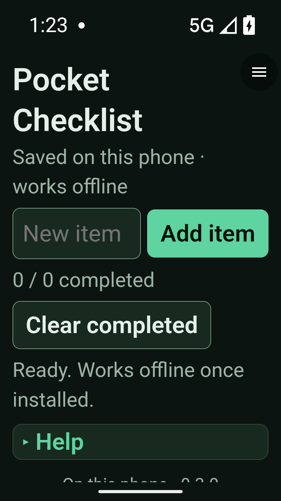

# UX-refresh verification checkpoint

**Alpha 21 pilot promoted; review remains open.** These are actual Android screenshots using
synthetic test state, not the clickable design mockup. No private photos or
contact data are shown. Public main is unchanged while PR #10 is reviewed.

Additional actual Android emulator render: [Contacts with synthetic details](../media/ux-refresh/contacts-detail.png).

## Candidate identity

App source: `4f19bf7`. Subsequent runner-only commits do not change app or module
source. The optimized x86-64 APK SHA-256 is
`c810926c3f5e54315756e39912b75008104f2d099517710adcb03364611dfff4`.
The ARM64 counterpart is
`00fe88c7aba5b51d931db7e1f658a0de9557938f89aa180865e5a922caaa88e8`
(23,594,175 bytes). This operator-profile artifact preserves the existing app
signer, permissions, publisher key, historical bundled demo files and models.
Both packaged ABIs passed the 16 KB ZIP alignment check. Generated baseline
profiles necessarily change with app code and are not treated as model assets.

## Completed scopes

- Final app source: 133 JVM tests, zero failures/errors; lint zero errors and
  18 warnings. Runner: 63 unit checks, including status-bar/window ordering and
  verifying non-root ADB identity after transport reconnects.
- Android 16 UX, first six checks: local-only initial Library, one latest normal
  candidate per tool, all eight exact signed packages installed via Versions and
  consent, Hello counter restart, literal Checklist keyboard entry/offline
  reopening, and visible Tones/Camera/Measure default denial with menu clearance.
- Separate clean Android 16 layout continuation: the exact Checklist fixture,
  native 360dp/font-scale-2 Settings/Browse and Checklist layouts, and landscape
  navigation/controls. Screenshots reviewed; scrolling is expected for long text.
- Android 16 Snake: all eight gameplay/state/menu/rotation/revocation checks pass.
- Android 17 host: five Checklist checks, bounded probes at **5 BLOCKED /
  6 CONTAINED / 0 FAIL**, renderer-loss recovery without restarting the host,
  seven tone-grant/lifecycle checks and five consent checks. The complete scope
  stopped its emulator successfully.
- Android 17 Focus: six checks, including quiet completion, paused restart,
  one-shot tone, menu/background behavior and storage revocation/recovery.
  Focus completed before the subsequent Contacts driver stopped on the old trial
  label. That combined run remains failed; Contacts is verified separately.
- Android 17 Contacts: nine checks pass, covering both permission gates, synthetic
  provider search/paging/typed details, accent and duplicate-name behavior,
  revocation, landscape keyboard behavior, offline reads and privacy cleanup.
- Android 17 camera/gallery: all 13 checks pass, including native capture,
  saved-photo recovery, rotation, 2× text portrait/landscape, album quota and
  deletion, both revocation paths, offline access, gallery cancellation and a
  published JPEG byte-identical to the private original. Deleting that original
  left the independent gallery copy intact. The emulator stopped successfully.
- Android 17 vision: all seven first-use-offline detection, negative-control,
  orientation, result-cleanup, original-JPEG integrity and diagnostics-privacy
  checks pass. ADB returned to the verified non-root shell and the emulator
  stopped. Earlier setup/ADB-transport failures remain separate failed receipts.
- Android 17 measurement: all 28 checks pass, including synthetic planar and
  perspective geometry, EXIF orientation, immediate endpoint placement,
  drag/cancel/nudge/Undo, zoom/pan, enlarged text, landscape fit, rotation
  retention, background/process cleanup, revocation and original-file/privacy
  checks. The emulator stopped successfully.

The UX evidence is deliberately **across documented runs**, not a claim that the
initial full UX run passed. Failed runs were retained: a new test imported the
wrong helper; a later driver used the status-bar window's bounds after restart;
then the large-text test expected a Settings button above the fold. Corrections
are in the runner. The final unfinished layout scope was run separately rather
than reclassifying those failed runs as complete. The APK was unchanged.

The first Android 17 host run also retained a driver failure: it confused the
Library's hamburger label with a still-running module after a contained probe.
The corrected observer checks the foreground activity; the clean rerun above
passed without an app change. These are bounded acceptance checks, not complete
sandbox/egress proof or a blanket absence-of-timeouts claim. Runtime records
retain unrelated emulator Bluetooth crashes and non-user-perceptible timeout
metadata during the probe scope; neither is relabelled as an app crash fix.

Native camera/photo screens retain `FLAG_SECURE`, so their screen captures can be
black. Native large-text evidence therefore uses the real accessibility bounds,
non-overlap of photo/control viewports, reachable confirmation controls and
unchanged saved-photo checks—not a claim of pixel review of a protected screen.
Physical visual inspection remains part of the focused phone check.

The camera layout observer initially made unnecessary gestures over a panel
already at its top, then sampled immediately after dialog cancellation. Both
failed runs remain retained. Stopping at a visible panel header and waiting for
stable post-dialog bounds allowed the unchanged APK to pass the 2× text layout
check: portrait photo `[0,36–720,640]`, controls `[0,640–720,1244]`; landscape photo
`[0,36–742,684]`, controls `[742,36–1280,684]` in emulator pixels. Gallery/delete
cancellation retained the saved photo. The full album/export scope then completed
successfully on that same run.

## Evidence limits and phone review

The previously documented Android 17 software-emulator Snake timing limitation
is not claimed fixed. ARM64 visual,
physical input and native-camera confirmation remain a focused phone check.

The operator-profile ARM64 download was verified over both configured delivery
routes against the frozen APK hash above. All eight exact tested module ZIPs
were promoted with their verified signatures; historical versions were retained
and the catalog index was published last. The source remains on the review
branch, not merged to public main.

All runners restore disposable app-free snapshots and stop after each scope.
Final checks found all emulator services stopped. Android 16's saved RAM,
hardware and texture files retained their prior timestamps; the normal snapshot's
`snapshot.pb` metadata changed during loading, so no all-files-byte-identical
preservation claim is made. The tests use `-no-snapshot-save`; the Android 16
camera snapshot metadata hash remained unchanged.
Raw receipts stay operator-private because they contain deployment URLs and
runtime metadata. See [runner setup](../android-runner.md) for reproduction.
